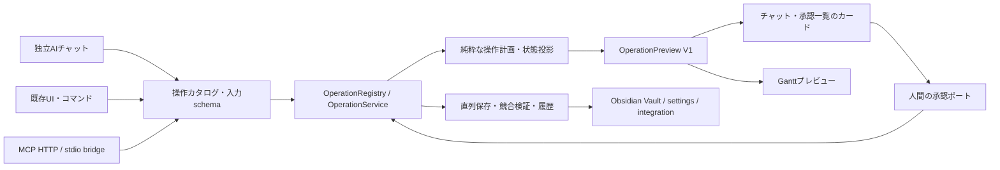

# AI操作・全操作プレビュー・コンテキスト・MCP設計

調査日: 2026-10-09。対象はこの作業ディレクトリの現行ソース。設計のみで、実装は行わない。

## 1. 結論と調査範囲

- 現存する意味上の操作を **123種類** として台帳化した。内訳はタスク30、マーカー・タスク作業時間8、イベント7、定例作業3、Daily ToDo9、設定・休日・タグ定義・ソース・同期35、表示・履歴・診断23、チャット制御8。
- 123はAIツールの個数ではない。同じ保存・表示効果を呼ぶボタン、コマンド、右クリック、ドラッグは入口を併記して1種類に統合する。フィールド編集、複合操作、一括操作は入力・副作用・確認単位が異なるため別に数える。UI未接続でも実装済みのサービス操作は明示して含める。
- 現行のLLM向け `OPERATION_MANIFEST` は **6ツール**: `search / get / create / update / schedule-batch / update-batch`。`patchSchema` は19フィールドを受理する。ツール数と機能網羅率を混同しない。
- A・C・Dは共通の操作実行サービスを拡張し、Bは型付きプレビュー記述子を描画する。操作の意味、検証、予測計算、承認、保存、履歴はトラック1、カード・Ganttの表示はトラック2が所有する。
- MCPのstdioは **起動中プラグインのローカルStreamable HTTPへの薄いブリッジ** を推奨する。HTTPもstdioも同じVault・操作基盤・プレビュー→Obsidianでの承認を使う。

ユーザー指定の `68dbd56` は履歴上の参照情報として扱った。Git操作禁止のため、そのコミットの内容、現行HEADとの関係、ブランチ一致は検証していない。以下の根拠はすべて現行ファイルであり、特定コミットの実装と断定しない。

読み取り根拠:

| 範囲 | 主な根拠ファイル・シンボル |
| --- | --- |
| コマンド・接続 | `src/main.ts`: `onload`, `registerCommands`, `workbenchViewHost`, `ganttViewHost` |
| 操作・書き込み | `src/app/operation-registry.ts`, `task-operations.ts`, `task-file-service.ts`, `src/core/task-patch.ts`, `note-format.ts` |
| Gantt操作 | `src/ui/task-gantt-view.ts`, `src/app/gantt-drag.ts`, `gantt-task-service.ts`, `gantt-layout.ts` |
| 一覧・埋め込み・検索 | `src/ui/task-workbench-view.ts`, `task-finder-modal.ts`, `src/app/workbench-display.ts`, `src/main.ts:renderEmbed` |
| Daily ToDo・定例作業 | `src/app/daily-todo-service.ts`, `daily-note-creation.ts`, `src/ui/modals.ts` |
| 設定・休日・同期・診断 | `src/ui/settings-tab.ts`, `src/app/holiday-service.ts`, `auto-priority.ts`, `gantt-sync-service.ts`, `src/core/logger.ts` |
| AI・現行プレビュー | `src/ai/chat-session.ts`, `sdk-provider.ts`, `src/agent-tools/tool-adapter.ts`, `src/ui/agent-view.ts`, `ghost-layer.ts`, `schedule-timeline.ts`, `src/app/schedule-ghost.ts` |
| 既存の検証例 | `tests/app/operation-registry.test.ts`, `operation-coverage.test.ts`, `history-manager.test.ts`, `gantt-drag.test.ts`, `daily-todo-service.test.ts`, `tests/ui/agent-view*.test.ts`, `ghost-layer.test.ts` |

通常のDOMイベント、テキスト欄のフォーカス、入力取消、モーダルを閉じる、ホバー解除は各操作のライフサイクルとして扱い、別操作には数えない。自動描画、キャッシュ削除、旧設定の移行、タイマーの起動も操作の付随処理である。単独で効果のない `openDailyTodoEditor` は台帳外。親タスクのファイル削除・移動、サブタスクの親変更、依存関係編集、独立したProject CRUDは現存しないため新機能として加えない。

## 2. 現行基盤の性質

### 2.1 データと制約

- Markdownがタスクの正本。対象は `taskFolder` 以下のMarkdownで、frontmatterの `type: task` が必要。親IDはVault相対ファイルパス、子IDは `親パス::subtaskKey`。子は同じ親ファイルの `Subtasks` セクションに存在する。名前変更はファイルパスや子keyの変更を意味しない。
- 親はGantt表示可否・親順序を持つ。予定開始・終了、作業時間、マーカーは子のみ書き込み可能。親の期間は子から導出する。親に直接予定日をpatchすると拒否される。
- 日付は実在する `YYYY-MM-DD`。予定日・期限は `""` で解除できる。両端をマージした結果で開始≦終了を検証する。期間は両端を含む。
- `statusLabel` は `active / in_progress / waiting / hold / done`。`done` は完了をtrueにする。完了だけtrueならdone、falseならactive。非done状態のみ指定すると完了false。矛盾する複合patchの実際の正規化結果もプレビューに含める。
- `displayName / title` は同じ名前に同期し、両方指定時はdisplayNameが優先。`updatedAt` はpatch受理後も常に今日に上書きされる。更新日を任意の日付に変更できる操作として案内しない。
- 優先度は0〜5に正規化。明示のpriorityがない変更では、自動優先度が有効かつautoモードなら期限で再計算される。手動指定はpriorityと `priorityMode: manual` を一緒に送る。自動へ戻すUIは、全体自動設定がOFFでも期限由来priorityを明示計算して保存する。
- `tags / ganttMarkers / workloadPlan / workloadActual` のpatchは全置換。差分追加ではない。作業時間はhours、0.5h刻みに丸め、0以下を削除、24h超を拒否する。日ごとの計画・実績は独立。UIペイントは休日に入力できず、表示上限は既定7hだが、保存上限24hとは異なる。
- 文字列長、配列件数、1行制約はregistryのZod schemaで検証する。マーカーは一意key・非空タイトル・実在日が必要。親子種別の制約は `normalizeTaskPatch` にもある。schemaだけで完全なドメイン制約になっていない。

### 2.2 計画・承認・履歴・表示

`OperationRegistry.plan` はタスクを再読込し、正規化・再parse照合後のdiffを作成する。保留計画は10分、最大50件。`commit` は計画を同期的に1度消費し、キューで直列実行する。内容比較と、利用可能なら `Vault.process` による更新直前の比較を使う。複数ファイルはトランザクションではなく、成功・一部保存・失敗・停止・失効を区別する。

現行のUIタスク更新・親子作成の多くはregistryを通るが、イベント・定例作業・設定・Daily ToDo・日付付き子作成・子削除・自動優先度更新には別経路がある。これらは同じ直列化・競合検証に統一されていない。

履歴はMarkdownのbefore/afterのみ、メモリ内50件・約12MiBを基準に制限される。設定は履歴対象外。親作成は履歴バリア。registry経由の子作成は親ファイルの差分を記録できるが、直接 `addSubtaskWithPlan` / `deleteSubtaskTaskItem` を呼ぶ経路は履歴を消す。Daily ToDoの書き込みも履歴を消す。Undoは履歴先頭と現在内容が一致するときのみで、外部編集を上書きしない。

現行のプレビューは次の2つを区別する。

1. **承認前のチャットカード**: 全registry mutationにgenericなフィールドdiffがある。日程はミニタイムライン。それ以外はJSON/文字列寄りで、変更後の業務上の見え方までは再現しない。
2. **保存後のGantt残像**: `ChatSession` の成功結果通知→`ScheduleGhostStore.show(result)`。旧期間と変更後の注記を最大100件・60秒表示する。承認前Ganttプレビューではない。対象判定は予定開始・終了・期限のfield。期限だけの変更も対象になるが、保存されるghostには期限座標がなく、期限マーカーのbefore/after表示は不足する。

`OperationRegistry` は日程以外のupdateにもscheduleオブジェクトを付けるため、現行カードが無関係なミニタイムラインを表示し得る。Bでは実際に変わった意味上の効果から表示種別を決定する。

チャットは `SdkChatProvider` がregistryを直接利用し、`agentToolsEnabled` に依存しない。一方、互換 `ToolAdapter` はその設定で無効化され、既定値はfalse、現行設定タブに切替UIもない。この違いを「AI可」の判定に反映した。

## 3. 全操作台帳（123種類）

記号:

- Undo **○**: registry更新で履歴を記録。**条件**:経路・履歴先頭・内容一致に依存。**×**:プラグイン履歴なし。**―**:データ変更なし。
- AI **○**:独立チャットの現行6ツールから利用可能。**patch**:全置換等をAIが自力構成すれば可。**組合せ**:同等状態は複数提案で作れるが、同じ操作意味・確認単位ではない。**×**:ツールなし。
- Preview **C**:承認前genericチャットカード。**C+G後**:Cに加え保存後の日程ghost。**入力**:手動UIの編集中表示だけ。**×**:承認前の変更後UIなし。**―**:読み取り・表示操作の結果そのもの。Cは完成した専用UIを意味しない。

各表の「制約」は現状。設計で追加する検証を混ぜない。T〜Qは台帳IDで、将来のツール名とは独立する。

### 3.1 タスク（T01〜T30、30種類）

主な根拠: `operation-registry.ts`, `task-patch.ts`, `task-operations.ts`, `main.ts` のhost、Workbench/Ganttの保存関数。

| ID | 名前・意味／入口 | 入力 | 現行の制約・検証・副作用 | Undo | AI | Preview |
| --- | --- | --- | --- | --- | --- | --- |
| T01 | 管理タスク検索 | query? | 名前・titleの部分一致、case insensitive、空query全件、LLM結果は先頭100件、ページなし | ― | ○ search | ― |
| T02 | 1タスク取得 | taskId | 親・子の実ID。未存在はエラー。親getは子Mapを返さない | ― | ○ get | ― |
| T03 | 親タスク作成／コマンド・Workbench | name | trim非空、LLM最大200字。今日の年月フォルダー、名前をサニタイズ、衝突suffix。Gantt無効で開始 | ×、履歴バリア | ○ create | C |
| T04 | 子作成／現ノート・親の＋・Gantt親メニュー | parentTaskId, name | 親のみ、1階層、key衝突回避、日程未設定。registryは再読込、直接helperは渡された親を変更 | 条件、registry○ | ○ create | C |
| T05 | Gantt管理する新規親作成 | name | T03→Gantt有効＋既存親の最後のorder。現状2回保存、親作成自体はUndo不可 | 条件、有効化だけ○ | 組合せ create+update | C、全体の専用UIなし |
| T06 | 指定日に子を作成／空セルメニュー | parentId, name, date | UIは休日を前方営業日にsnap、1日予定。helperは日付patchを単純merge、registry外 | ×、履歴バリア | 組合せ create→update | ×、組合せならC |
| T07 | 親・子の名前変更／一覧・bar・親列 | taskId, name | 非空1行、title/displayName同期。パス/keyは不変 | ○ | ○ update | C |
| T08 | 状態変更／一覧・popover | taskId, statusLabel | 5値。完了との連動を適用 | ○ | ○ update | C |
| T09 | 完了／未完了切替 | taskId, completed | done/activeへの連動。Ganttメニューは両フィールドを明示 | ○ | ○ update | C |
| T10 | Current Status更新・解除 | taskId, text | 複数行可、LLM最大20000字、保存時trim等の影響を照合 | ○ | ○ update | C |
| T11 | Notes更新・解除 | taskId, text | APIは更新可、専用編集UIはない。見出し等でround trip不能ならregistry拒否 | ○ | ○ update | C |
| T12 | 作成日変更 | taskId, createdAt | 日付または空。UI列は読み取り専用、空の再parseは今日になるため拒否され得る | ○ | ○ update | C |
| T13 | 期限設定・移動・解除／一覧・親期限drag・メニュー | taskId, dueDate | 日付/空、親子可。UI親期限dragは営業日補正。期限変更は自動priorityにも影響 | ○ | ○ update | C+G後、期限の残像は不完全 |
| T14 | 手動優先度指定／星 | taskId, priority | 0〜5。UIは1〜5＋manual。明示priorityのみではmodeは変わらない | ○ | ○ update | C |
| T15 | 自動優先度へ戻す／星再click・リセット | taskId | UIは期限でpriorityを計算しautoも指定。設定OFF時も計算値を書き込む | ○ | patch update | C |
| T16 | 親・子のタグ設定・付与・解除 | taskId, tags[] | 全置換。UI文字列はカンマ分割、Ganttは定義名へcanonicalize。表示は定義順・色に依存 | ○ | patch update | C |
| T17 | 親のGantt管理開始／停止／既存親picker | parentId, enabled, order? | 親のみ。無効化でも子の日程・時間・マーカーを保持。追加時のorderは入口で異なる | ○ | ○ update | C |
| T18 | Gantt親順序変更／親drag | orderedParentIdsまたはparentId, order | 有限order。UIは親リストを組替えて1000刻みに再採番、複数親をbatch保存 | ○ | patch update-batch | C |
| T19 | 子の予定開始・終了を直接設定／popover・API | subtaskId, start?, end? | 種別・実在日・マージ後範囲検証。直接patchは休日snap・時間移動をしない | ○ | ○ update | C+G後 |
| T20 | 子の期間全体を移動／bar drag | subtaskId, calendarDelta | 移動方向へ営業日snap、営業日数を維持、マーカーを再配置。実績があれば警告。単体dragは時間mapを移動しない | ○ | 組合せ、単なる日付patchは非等価 | C+G後、算出patchのみ |
| T21 | 子の開始側を伸縮／bar左端drag | subtaskId, date/delta | 開始側snap、終了を越えない。マーカー・時間mapを変えない | ○ | patch update | C+G後 |
| T22 | 子の終了側を伸縮／bar右端drag | subtaskId, date/delta | 終了側snap、開始を下回らない。マーカー・時間mapを変えない | ○ | patch update | C+G後 |
| T23 | 未配置の子を指定日に配置 | subtaskId, date | UI候補は両端未設定の子、最大20表示。1日予定、営業日snap | ○ | patch update | C+G後 |
| T24 | 子をGanttから外す | subtaskId | 両予定日を空にする。タスク・時間・マーカーを削除しない | ○ | ○ update | C+G後 |
| T25 | 親の指定子以降を一括移動／Bulk-Move | parentId, anchorId, shiftDays | 開始・終了・名前でsortしたanchor以降。日程は暦日差、マーカー再配置、計画・実績を営業日相対位置で移動。一括警告 | ○ | patch update-batch、意味ツールなし | C+G後、算出patchのみ |
| T26 | 子をタスクとして削除 | subtaskId | UI確認あり、親・key検証、親ファイルから該当子を削除。親ファイルは残る | ×、履歴バリア | × | × |
| T27 | 複数タスクのフィールド一括更新 | changes[{taskId,patch,expectedRevision?}] | LLM1〜100件、同一ID重複禁止、親ファイル単位1回保存、複数ファイルは部分保存あり | ○、保存分 | ○ update-batch | C、日付ならG後 |
| T28 | 複数タスクの日付一括設定 | changes[{taskId,schedule,expectedRevision?}] | 開始・終了は子、期限は親子。最大100件。Bulk-Moveの意味は持たない | ○、保存分 | ○ schedule-batch | C+G後 |
| T29 | 1タスクの複合フィールド更新 | taskId, patch, expectedRevision? | strict19キー、種別検証、正規化、暗黙の更新日・priority変化、round trip照合 | ○ | ○ update | C、日付ならG後 |
| T30 | 全管理タスクの自動優先度再計算 | force?、設定・今日 | 起動時/設定ONで呼ぶ。auto対象のみ、日単位で抑制、force可、専用コマンドなし。registry外の全ノート再構築 | ×、履歴記録なし | × | × |

### 3.2 マーカー・タスク作業時間（M01〜M08、8種類）

根拠: Ganttのmarkerメニュー・drag・workload paint、`task-patch.ts:normalizeMarkers/normalizeWorkloadMap`。

| ID | 名前・意味 | 入力 | 現行の制約・検証 | Undo | AI | Preview |
| --- | --- | --- | --- | --- | --- | --- |
| M01 | 子にマーカー追加 | subtaskId, title, date, tags? | UIはbar内クリック位置・生成key。保存は全配列、非空title・一意key・実在日 | ○ | patch update | C、配列JSON |
| M02 | マーカー名・日付編集 | subtaskId, markerKey, patch | modal/inline。実在日。既存要素を置換して全配列保存 | ○ | patch update | C、配列JSON |
| M03 | マーカー日付drag | subtaskId, markerKey, date | UIは営業日へsnap、bar期間内にclamp。直接全配列patchにはその補正なし | ○ | patch update、補正はAI側 | C、G後なし |
| M04 | マーカー削除 | subtaskId, markerKey | 該当keyを配列から除去 | ○ | patch update | C、配列JSON |
| M05 | マーカーのタグ付与・解除 | subtaskId, markerKey, tags[] | タグ定義を参照、マーカー配列の全保存 | ○ | patch update | C、配列JSON |
| M06 | マーカー全置換・全解除／API | subtaskId, markers[] | 最大100個。空配列で全解除。既存マーカーの自動mergeなし | ○ | ○ update | C、配列JSON |
| M07 | 子の計画時間設定・消去／paint/API | subtaskId, workloadPlan{date:hours} | map全置換、0.5h丸め、0以下削除、24h超拒否。UIは休日不可・表示上限 | ○ | patch update | C、map JSON |
| M08 | 子の実績時間設定・消去／paint/API | subtaskId, workloadActual{date:hours} | M07と同じ。実績移動と予定移動は別の意味 | ○ | patch update | C、map JSON |

### 3.3 イベント・定例作業（E01〜E07、W01〜W03、10種類）

根拠: `gantt-task-service.ts` とGanttの「その他」「定例作業設定」。イベントはTaskRowではなくsettings内の1日データ。

| ID | 名前・意味 | 入力 | 現行の制約・検証 | Undo | AI | Preview |
| --- | --- | --- | --- | --- | --- | --- |
| E01 | その他行にイベント追加 | title, date | key生成、空titleは「新しいタスク」。helper自体は日付検証なし | × | × | × |
| E02 | イベント名変更 | eventKey, title | double clickのinline編集。helperはmissing keyで無操作 | × | × | 入力 |
| E03 | イベントを別日に移動 | eventKey, date | drag、settingsのdateだけ変更。時間mapの日付を移動しない | × | × | 入力 |
| E04 | イベント複製 | eventKey | 新key、title/dateを保持、計画・実績mapは独立copy | × | × | × |
| E05 | イベント削除 | eventKey | 該当settings要素を除去、missing key無操作 | × | × | × |
| E06 | イベント計画時間設定・消去 | eventKey, plan{date:hours} | paint・map正規化、settings保存。event.date以外のmapをhelperは保持し得る | × | × | 入力 |
| E07 | イベント実績時間設定・消去 | eventKey, actual{date:hours} | E06と同様、計画と独立 | × | × | 入力 |
| W01 | 定例作業追加 | title, dayOfWeek, minutesPerWeek | 日曜0〜土曜6をUI選択。分は非負30分倍数へ丸め。helperの曜日検証は不足 | × | × | × |
| W02 | 定例作業名・曜日・分数変更 | scheduleKey, partial patch | 即時保存。分は正規化、missing key無操作 | × | × | 入力 |
| W03 | 定例作業削除 | scheduleKey | settings配列から削除 | × | × | × |

### 3.4 Daily ToDo（D01〜D09、9種類）

根拠: `daily-todo-service.ts`, `daily-note-creation.ts`, `DailyTodoModal`。pathとlineは既存行の識別に使い、永続IDはない。新規挿入先は現状 `sourceKey: main` 固定。任意sourceへの新規挿入を既存機能と誤認しない。

| ID | 名前・意味／入口 | 入力 | 現行の制約・検証 | Undo | AI | Preview |
| --- | --- | --- | --- | --- | --- | --- |
| D01 | 日別ToDo・完了件数の取得 | configured sources、日付 | Vaultからソース書式に一致するノートを収集。既存ToDo行をparse、source別に保持 | ― | × | ―、Gantt chip/hover |
| D02 | mainのデイリーノート作成／挿入時の付随操作 | date, source設定, templatePath? | 未作成かつcreatableFromGanttのみ。Templaterがあれば実行、失敗時はraw copy、template不在は空ノート | × | × | × |
| D03 | mainへToDo追加 | date, text, completed? | trim非空、`## ToDoリスト` の末尾かEOFへ挿入、D02を伴い得る | ×、履歴バリア | × | 入力 |
| D04 | 既存ToDoの文面変更 | path, line, text | 行範囲・file存在・非空を検証。行内容/revisionの同一性検証なし | ×、履歴バリア | × | 入力 |
| D05 | 既存ToDoの完了切替 | path, line, completed | D04と同じ行識別、checkbox書式で再保存 | ×、履歴バリア | × | 入力 |
| D06 | 既存ToDo削除／service helperのみ | path, line | `deleteDailyTodoItem` は実装済みだがproduction UIから未呼出。行範囲だけ検証 | ×、履歴バリア | × | × |
| D07 | 日別ToDoの一括保存／modal | summary, nextItems[] | 既存の編集＋新規挿入。nextItemsから消えた行・空になった既存行は削除されず保持。ファイル単位保存 | ×、履歴バリア | × | 入力 |
| D08 | ToDo元ノートを開く／service helperのみ | path | `openDailyTodoFile` 実装済み、現Gantt hoverは読み取り専用、未存在無操作 | ― | × | ― |
| D09 | プレースホルダーをquick add／service helperのみ | date | `openOrCreateMainDailyTodoForDate` が「新しいタスク」を実際に挿入する。単なるeditor openではない | × | × | × |

### 3.5 設定・休日・タグ定義・ソース・同期（S01〜S35、35種類）

根拠: `settings-tab.ts`, `holiday-service.ts`, `gantt-sync-service.ts`, Ganttの休日クリック・タグ作成。以下の設定保存には現行プラグインUndoもAIツールもない。

| ID | 名前・意味 | 入力 | 現行の制約・検証・影響 | Undo | AI | Preview |
| --- | --- | --- | --- | --- | --- | --- |
| S01 | 管理タスクフォルダー変更 | taskFolder | trim、空/`..` segmentはtasksへ。既存ファイルの移動なし、検索対象が変わる | × | × | × |
| S02 | 作成名の日付接頭辞切替 | filenameUsesDatePrefix | boolean。将来の作成だけ、既存パスは不変 | × | × | × |
| S03 | 完了を初期非表示にする設定 | hideCompletedByDefault | boolean。既存ビューのローカルshowCompletedと別 | × | × | × |
| S04 | Current Status欄行数 | currentStatusRows | Number、NaN/空は5、最小3。現UIは有限上限を検証しない | × | × | × |
| S05 | 自動優先度ON/OFF | autoPriorityEnabled | 保存後T30(force)を呼ぶ。OFFは再計算skip、manualは保持 | × | × | × |
| S06 | 手動休日追加・解除／曜日ヘッダーclick | date | 手動配列だけ変更。公式・特別休暇はclick解除不可。営業日計算と表示が変わる | × | × | × |
| S07 | 特別休暇全置換 | dates/text | 形式整形・重複除去・sort、実在日検証は不足。公式休日と別管理 | × | × | × |
| S08 | 公式祝日取得・更新 | force、内閣府CSV | 起動時/最長30日ごと、設定ボタンはforce。取得結果と更新日を保存。既存並行refreshはlockなし | × | × | × |
| S09 | Daily ToDo行表示切替 | ganttFeatureDailyTodoEnabled | boolean。source/ノートデータを保持 | × | × | × |
| S10 | 作業時間機能の表示切替 | ganttFeatureWorkloadEnabled | boolean。task/eventのmap・定例作業を保持 | × | × | × |
| S11 | その他イベント行表示切替 | ganttFeatureEventsEnabled | boolean。イベントデータを保持 | × | × | × |
| S12 | 同期UI表示切替 | ganttFeatureSyncEnabled | boolean。同期有効化S18とは別、表示だけ | × | × | × |
| S13 | タグ機能表示切替 | ganttFeatureTagsEnabled | boolean。定義・実タグを保持 | × | × | × |
| S14 | Gantt差分描画切替 | incrementalGanttRender | boolean。保存内容は同じ、描画方式変更 | × | × | × |
| S15 | 子barにタグ名表示 | ganttShowTagsOnBars | boolean | × | × | × |
| S16 | 親由来タグ名を子barに表示 | ganttShowParentTagsOnChildBars | boolean。OFFでも色の継承は維持 | × | × | × |
| S17 | 親列にタグ名表示 | ganttShowTagsOnParents | boolean | × | × | × |
| S18 | 定期外部同期ON/OFF | ganttSyncEnabled | boolean、保存後timer再起動、ONで即回実行し得る。外部への情報送信を伴う | × | × | × |
| S19 | 外部同期URL変更 | ganttSyncUrl | trim、`/api/snapshot` 補完。保存後timer再起動、現UI入力時URLの厳密検証なし | × | × | × |
| S20 | 外部同期間隔変更 | ganttSyncIntervalMinutes | Number、NaN/空は5、最小1分、timer再起動 | × | × | × |
| S21 | 今すぐ外部同期／Gantt・設定ボタン | configured endpoint | Gantt snapshotをPOST、forceで同一hashでも送信。Vaultは変更せず、外部副作用あり | × | × | × |
| S22 | タグ定義追加 | name, color?, order | 設定UIはタグN・空色、Ganttは指定名・既定色、keyを生成/再利用 | × | × | × |
| S23 | タグ定義名変更 | tagKey, name | trim空なら元名を保持、key不変。タスク側は名前文字列を持つため追従を保証しない | × | × | 入力 |
| S24 | タグ定義色変更 | tagKey, color | trim、空は色なし。pickerは6桁hex、テキスト欄は任意CSS色文字列 | × | × | 入力、swatchのみ |
| S25 | タグ定義優先順変更 | orderedKeys/offset | UI上下移動、orderを1000刻みに採番。優先色・タグ表示に影響 | × | × | × |
| S26 | タグ定義削除 | tagKey/index | 定義だけ削除、タスク・マーカーのtags文字列は保持 | × | × | × |
| S27 | 新タグ定義を作成して対象へ付与 | name, task/marker対象 | 同名/keyは再利用、canonicalize・dedupe。設定保存→タスク保存の2段、全体原子性なし | 条件、タスク側だけ○ | 組合せでも定義作成不可 | ×、タスクpatchならC |
| S28 | Daily ToDoソース追加 | label, format, creatable?, template? | 現設定ボタンは既定値をappend、安定key生成 | × | × | × |
| S29 | ソースラベル変更 | sourceKey, label | trim、空可、識別key不変 | × | × | 入力 |
| S30 | ソースの日付・パス書式変更 | sourceKey, momentFormat | raw保持、Moment書式。現在日付でパス例を表示。既存ノートは移動しない | × | × | 入力、パス例のみ |
| S31 | ソースtemplate設定・解除 | sourceKey, templatePath | trim空はundefined、存在検証は作成時 | × | × | 入力 |
| S32 | ソースのGantt新規作成許可 | sourceKey, creatableFromGantt | boolean。ただし現在の挿入先選択はmain固定 | × | × | × |
| S33 | ソース順序変更 | orderedKeys/offset | 配列順変更、集計・表示の順序に影響 | × | × | × |
| S34 | ソース定義削除 | sourceKey/index | 定義のみ、元ノートを削除しない。main削除で新規挿入不能 | × | × | × |
| S35 | Daily Notes設定からソース取込 | Obsidian設定 | enabledなPeriodic Notesを優先、core Daily notesへfallback。folderをliteral化、新規sourceをappend | × | × | × |

`ganttWorkloadMaxHours / ganttWorkloadDailyCapacityHours / agentToolsEnabled` は型・既定設定にあるが、現行UI・操作APIに変更入口がない。`lastAutoPriorityUpdate`、公式休日更新時刻等はサービス管理情報。これらを既存のユーザー操作として水増しせず、将来の設定schemaでは利用者編集項目と管理項目を分離する。

### 3.6 表示・履歴・診断（V01〜V23、23種類）

根拠: `NavigationService`, Workbench/Gantt、埋め込み、`HistoryManager`, `Logger`。データ変更でない操作にもBで結果表示を設けるが、読み取りに「変更承認」を強制しない。

| ID | 名前・意味／入口 | 入力 | 現行の制約・検証 | Undo | AI | Preview |
| --- | --- | --- | --- | --- | --- | --- |
| V01 | Workbenchを開く | position/既存leaf | command/ribbon/埋め込みのopen、既存leaf再利用 | ― | × | ― |
| V02 | Ganttを開く | position/既存leaf | command/ribbon/一覧、既存leaf再利用 | ― | ×、AIカードにボタンはある | ― |
| V03 | タスクfinderを開き検索 | query | 5フィールドのfuzzy検索。LLM searchの名前部分一致とは別 | ― | ×、T01は非等価 | ― |
| V04 | タスクノート・子見出しを開く | taskId | 親path、子headingリンク、失敗時file open fallback | ― | × | ― |
| V05 | 指定日のDaily ToDo編集modalを開く | date | commandは今日、Ganttはchipのdate。open時点では書込なし、SaveでD07 | ― | × | ― |
| V06 | AIチャットを開く | tab/left/right | 3コマンド、既存viewがあれば位置より再利用を優先 | ― | × | ― |
| V07 | 一覧・埋め込みのテキストfilter | viewId, text | ローカル状態。filter時編集中編集を破棄、IME配慮。埋め込みは取得時snapshotのまま | ― | × | ― |
| V08 | 一覧・埋め込みの状態filter | viewId, all/status | 5状態/all。ローカル状態、Vault書込なし | ― | × | ― |
| V09 | 一覧・埋め込みsortキー・方向 | viewId, sort, asc/desc | 期限/更新日/作成日/title/状態。日付sortには既存の方向規則あり | ― | × | ― |
| V10 | 階層を無視した期限順切替 | viewId, flatDueSort | 子もflat表示、collapseは階層modeのみ | ― | × | ― |
| V11 | 完了タスクの表示切替 | viewId, showCompleted | 初期値は設定、以降はローカル状態 | ― | × | ― |
| V12 | Workbench親の展開・折畳 | viewId, parentId, expanded | 階層modeのみ、保存なし | ― | × | ― |
| V13 | Ganttタグfilter設定・解除 | viewId, tagNames[] | 親/子/markerの判定に既存規則。無選択は全件、保存なし | ― | × | ― |
| V14 | Ganttズーム変更 | viewId, dayWidth | 14〜72px/日、UI±6、settings.ganttZoom保存 | × | × | ―、変更後表示 |
| V15 | 日付へ移動・表示範囲拡張 | viewId, date, offset? | 今日button/scroll。両端で60日ずつ範囲拡張、保存なし | ― | × | ― |
| V16 | 一覧・Gantt再読込 | viewId | Vaultからloadして再描画。データ変更なし | ― | × | ― |
| V17 | 詳細・日別内訳・定例設定を表示 | viewId, kind, target | task/parent popover、event/日別workload、Daily hover、定例modal。表示自体と編集を区別 | ― | × | ― |
| V18 | 作業時間paint対象mode切替 | viewId, task/event, plan/actual | 左/右click、view内mode Map、保存なし | ― | × | ― |
| V19 | Bulk-Move選択mode開始・解除 | viewId, parentId, anchorId | 選択集合・drag状態のみ。保存はT25 | ― | × | ― |
| V20 | 元に戻す | 履歴先頭 | 内容一致を検証、空/conflict/invalidatedを区別、同時Undo直列化 | redo対応 | ×、カードの人間ボタンのみ | ×、実行後statusのみ |
| V21 | やり直す | redo履歴先頭 | 同様、別の更新はredoを無効化 | undo対応 | × | ×、実行後statusのみ |
| V22 | 診断記録開始 | name? | commandは既定名、メモリbufferを初期化して記録 | × | × | × |
| V23 | 診断記録停止・Vaultへ保存 | recording状態 | 最大20000ログ、`_vault-gantt-logs/*.log` 作成。未記録なら無操作 | × | × | × |

`task-list` 埋め込みは既存ノートのcode blockを読み取る表示機能。V07〜V11/V04/V01を提供するが、プラグインが任意ノートに埋め込みblockを新規挿入する操作はない。

### 3.7 チャット制御（Q01〜Q08、8種類）

根拠: `chat-session.ts`, `agent-view.ts`, `sdk-provider.ts`。現在はいずれも人間のUIからのみで、6つのAIツールには登録されていない。

| ID | 名前・意味 | 入力 | 現行の制約・検証 | Undo | AI | Preview |
| --- | --- | --- | --- | --- | --- | --- |
| Q01 | 接続・モデル・既存secret選択 | provider, endpoint, model, auth, secretId | HTTPS/loopback HTTP、redirect禁止。接続設定はメモリのみ、適用だけでは通信しない。変更時running停止 | × | × | 入力 |
| Q02 | 会話作成 | なし | 最大10会話、古い会話の未承認planはdiscard、running停止 | × | × | ― |
| Q03 | 会話切替 | conversationId | 未存在無操作、running停止、会話別文脈 | × | × | ― |
| Q04 | AIへメッセージ送信 | text | 非空、接続済、同会話running不可、最大100message、モデル4step・120秒・output4096token | × | × | ―、応答 |
| Q05 | 応答・保存処理停止 | 実行中controller | AbortSignal、保存済み分は戻さない。停止とUndoは別 | × | × | ―、停止status |
| Q06 | 失敗応答の再試行 | 最後のuser message | 接続・状態検証、既存planの処理規則に従い再送 | × | × | ― |
| Q07 | 変更案を承認して保存 | proposal/previewId | 人間の確認button、plan1回消費、最新内容・期限を検証、部分保存を区別 | 条件、操作による | ×、ToolAdapter.confirmChangeはAPIあり | C→結果、日程ならG後 |
| Q08 | 消費済/失敗変更案の再プレビュー | proposal | 未保存対象を再plan、古いplanを自動再commitしない | ― | × | C |

### 3.8 コマンド登録との対応

`registerCommands` の10件にAI表示3件が加わり **13コマンド**。ribbonは2個。同じ操作への入口なので123に再加算しない。

| command id | 台帳 |
| --- | --- |
| open-task-workbench / open-task-gantt / open-task-finder | V01 / V02 / V03 |
| create-new-task-note / add-subtask-to-current-note | T03 / T04 |
| open-daily-todo | V05（今日） |
| start-log-recording / stop-log-recording | V22 / V23 |
| undo-last-action / redo-last-action | V20 / V21 |
| open-ai-chat-tab / open-ai-chat-left / open-ai-chat-right | V06（position違い） |

## 4. 共通アーキテクチャと先に固定する契約

### 4.1 依存方向



DOM、ObsidianのTFile、Map、関数、secret値をプレビューDTOに含めない。MCPもカードも同じJSONシリアライズ可能な記述子を読む。読み取り・表示操作の結果と、保留中変更の計画を区別する。

先行工程P0でトラック1が `src/contracts/` の契約、代表fixture、互換adapterを作成して固定する。以後トラック2はcontractsを読み取り専用とする。型変更は片方が独断で行わず、両方のfixture・consumerを更新する小さな統合工程に戻す。

### 4.2 固定する型の概要

以下は実装の契約見本。`OperationInputMap` は台帳IDに対応する入力型を列挙する。各型のruntime Zod schemaも同じcontractsに置く。台帳の名称・意味の説明はcatalog側、表示文言はUI側に置く。

```ts
type DateOnly = string; // runtimeで実在YYYY-MM-DD、暦日、TZ変換しない
type Revision = string; // content hash / settings subset hash、mtimeではない
type Json = null | boolean | number | string
  | readonly Json[] | { readonly [key: string]: Json };
type OperationId = keyof OperationInputMap;
type RequestOrigin =
  | { kind: "chat"; conversationId: string }
  | { kind: "mcp"; principalId: string; clientLabel: string }
  | { kind: "ui"; viewId: string }
  | { kind: "system"; cause: "priority" | "holidays" | "sync" };

type EntityRef =
  | { kind: "task"; taskId: string; parentId?: string }
  | { kind: "marker"; taskId: string; markerKey: string }
  | { kind: "event"; eventKey: string }
  | { kind: "weekly"; scheduleKey: string }
  | { kind: "daily-todo"; path: string; line: number; itemFingerprint: string }
  | { kind: "daily-file"; path: string; sourceKey: string }
  | { kind: "tag-definition"; tagKey: string }
  | { kind: "source"; sourceKey: string }
  | { kind: "setting"; key: EditableSettingKey }
  | { kind: "view"; viewId: string }
  | { kind: "conversation"; conversationId: string }
  | { kind: "integration"; targetId: string };

interface FieldChange {
  field: string; // entity別の公開field enumでruntime検証
  before: Json;
  after: Json;
  reason: "requested" | "normalized" | "derived";
}
interface Period { start: DateOnly | null; end: DateOnly | null }
interface HoursCell { date: DateOnly; plan: number; actual: number }
interface MarkerState {
  key: string; title: string; date: DateOnly; tags: readonly string[];
}
interface NamedDefinition {
  key: string; name: string; color: string; order: number;
}
interface WeeklyState {
  key: string; title: string; dayOfWeek: number; minutesPerWeek: number;
}
interface DailyState {
  path: string; sourceKey: string; text: string; completed: boolean;
}

type PreviewEffect =
  | { kind: "fields"; fields: readonly FieldChange[] }
  | { kind: "presence"; before: Json; after: Json;
      action: "create" | "delete" | "duplicate" }
  | { kind: "schedule"; before: Period; after: Period;
      unit: "calendar-day" | "business-day" }
  | { kind: "deadline"; before: DateOnly | null; after: DateOnly | null }
  | { kind: "marker"; before: MarkerState | null; after: MarkerState | null }
  | { kind: "workload"; cells: readonly {
      date: DateOnly; before: HoursCell; after: HoursCell;
    }[] }
  | { kind: "order"; before: readonly string[]; after: readonly string[] }
  | { kind: "membership"; before: boolean; after: boolean;
      retained: readonly ("schedule" | "workload" | "markers")[] }
  | { kind: "tag-definition"; before: NamedDefinition | null;
      after: NamedDefinition | null; affectedCount: number }
  | { kind: "weekly"; before: WeeklyState | null; after: WeeklyState | null }
  | { kind: "daily-todo"; before: DailyState | null; after: DailyState | null }
  | { kind: "calendar"; added: readonly DateOnly[];
      removed: readonly DateOnly[]; source: "manual" | "special" | "national" }
  | { kind: "settings"; fields: readonly FieldChange[] }
  | { kind: "view"; before: Json; after: Json; affectedIds: readonly string[] }
  | { kind: "external-send"; destination: string; payloadDigest: string;
      taskCount: number; fieldsSent: readonly string[]; bytes: number }
  | { kind: "diagnostic"; recording: boolean; outputPath?: string;
      entryCount?: number }
  | { kind: "conversation"; action: string; before: Json; after: Json };

interface PreviewEntry {
  actionId: string;             // 保存結果と1対1で照合するID
  entity: EntityRef;
  displayName: string;
  effects: readonly PreviewEffect[]; // 複合操作では複数、全副作用を含む
}
interface OperationPreviewV1 {
  schemaVersion: 1;
  previewId: string;            // Vaultインスタンス内でランダム、一度きり
  vaultInstanceId: string;
  operationId: OperationId;
  origin: RequestOrigin;
  status: "pending" | "applying" | "success" | "partial" | "failed"
    | "cancelled" | "rejected" | "stale" | "expired";
  createdAt: string; expiresAt: string; // ISO timestamp
  summary: { targetCount: number; actionCount: number };
  entries: readonly PreviewEntry[];
  warnings: readonly { code: string; detail: string }[];
  undo: { support: "full" | "partial" | "none"; reason?: string };
  projection: GanttProjectionV1 | null;
}

interface OperationOutcomeV1 {
  previewId: string;
  status: "success" | "partial" | "failed" | "cancelled" | "stale";
  actions: readonly {
    actionId: string;
    state: "committed" | "failed" | "not-attempted";
    actual: readonly PreviewEffect[]; errorCode?: string;
  }[];
  undoEntryId?: string;
}
interface PreviewPort {
  list(): readonly OperationPreviewV1[];
  inspect(previewId: string): OperationPreviewV1 | undefined;
  subscribe(listener: () => void): () => void;
  focus(previewId: string | null): void;
  reject(previewId: string): Promise<void>;
  requestRepreview(previewId: string): Promise<OperationPreviewV1>;
}
interface HumanApprovalPort {
  approve(previewId: string): Promise<OperationOutcomeV1>;
  // Obsidian UIにだけ渡す。SDK/MCPツールにこのポートを渡さない。
}
```

`GanttProjectionV1` の固定項目:

| 項目 | 契約 |
| --- | --- |
| baseRevision, settingsRevision, calendarRevision, evaluatedDate, timezone | 投影の前提。日付・休日・設定の変更で再計画する |
| before / after | 独立したimmutable `GanttStateV1`。affectedな親＋全子、events、weekly、daily counts、tag definitions、関連表示設定、休日を含む |
| 親 | id/name/enabled/order/tags、children、導出されたperiod・進捗・effectivePriority |
| 子 | id/parentId/name/status/completed/tags/period/due/markers/日別hours。Obsidianオブジェクトを含めない |
| 日別集計 | date、plan/actual total、capacity、overCapacity。before/afterで同じ集計規則を使用 |
| visibility | targetごとの `visible / filtered / feature-disabled / unscheduled / outside-range` と理由。viewport依存のoutside-rangeはUIで補完 |
| affectedParentIds / affectedDates / coverage | 更新範囲、影響件数、全文取得済みか。省略があれば `truncated` と詳細取得cursorを明示 |

投影は保存時に使う正規化済みafter状態から生成する。UIはpixel座標・配置を既存layout関数で計算してよいが、予定日や集計値・タグ継承の業務ルールを独自に推測しない。100件超の影響でも承認対象を黙って省略しない。カードの描画は仮想化し、完全な計画をメモリと詳細取得で保持する。

planのprivate情報（読み取ったファイル全文、hash、実行順、許可capability、設定patch、外部送信body）はregistry側のみ。`PreviewEntry` は改ざんされたJSONを受け取ってcommitするための命令ではない。commitは保存した内部planのIDだけを解決する。

origin/principal/capabilityはtransportと内部UIの接続情報からサーバーが構成する。toolの引数に `origin: ui` 等を指定して承認権限を獲得することはできない。UI表示用のclientLabelも権限判定には使わない。

## 5. A: 全操作のAI利用と説明文

### 5.1 カタログと実行インターフェース

`src/app/operation-catalog.ts` に台帳の全IDと操作定義を置き、現行manifestを段階的に移す。`OperationRegistry` は互換入口として残し、ドメインhandlerへ委譲する。既存6ツールを即削除しない。

```ts
interface OperationDefinition<K extends OperationId> {
  id: K;
  inputSchema: Schema<OperationInputMap[K]>;
  outputSchema: Schema<OperationOutputMap[K]>;
  effect: "read" | "view" | "write" | "external" | "control";
  description: {
    purpose: string; targetKinds: readonly string[];
    parameters: readonly ParameterDoc[];
    constraints: readonly string[]; sideEffects: readonly string[];
    clearSemantics: readonly string[];
    examples: readonly { input: OperationInputMap[K]; explanation: string }[];
    errors: readonly string[]; undo: string;
  };
  capability: "read" | "propose" | "ui" | "external" | "diagnostic" | "chat-control";
  previewKinds: readonly PreviewEffect["kind"][];
  read?: ReadHandler<K>;
  plan?: PlanHandler<K>;
}
interface OperationService {
  describe(ids?: readonly OperationId[]): readonly PublicOperationDescription[];
  read<K extends OperationId>(id: K, input: OperationInputMap[K],
    context: RequestContext): Promise<OperationOutputMap[K]>;
  propose<K extends OperationId>(id: K, input: OperationInputMap[K],
    context: RequestContext): Promise<OperationPreviewV1>;
  inspect(previewId: string, context: RequestContext): OperationPreviewV1;
  // 実commitはHumanApprovalPortでのみ公開
}
```

`Schema`, `ParameterDoc`, maps、handlerの具体型はcontractsで定義する。read/view/write/external/controlの区別は「mutation boolean」より詳細にする。読み取りの取得結果は `ReadResultV1`、表示操作の適用前状態はview effectとして扱う。モデルはツール実行の実績と、提案がpendingであることを区別できる。

全123操作はカタログに登録し、入口・必要capability・現在の利用可否・拒否理由を返す。AIからの要求可能範囲はドメイン/設定/表示/診断/会話制御まで対応させる。秘密や承認権限の変更、Q07の実承認は人間だけが行う。これは機能を隠すのではなく、`request approval` と `approve` の別権限で表現する。自分を実行中のQ04/Q06等は再入を拒否し、別会話を対象にするか応答完了後に実行する。全操作利用に含める会話制御・診断の既定capabilityは未決事項として明示する。

ツール定義の粒度は1操作1ツール固定にしない。下記familyをtyped discriminated unionで公開し、各variantに説明を付ける。LLMには短い共通説明＋必要なfamilyの説明を渡し、`operations.describe` で長い例・制約を取得できる。重要な副作用は追加取得がなくても各schemaのdescriptionで分かるようにする。

| 公開family案 | 台帳との対応 |
| --- | --- |
| tasks.search/get/update/create、tasks.batch.propose | T01〜T04、T07〜T19、T27〜T29。19キーの低レベルpatchは互換入口 |
| gantt.parents.propose / gantt.schedule.propose | T05〜T06、T17〜T25。移動/伸縮/配置/解除/Bulk-Moveを明示variant化 |
| subtasks.delete.propose / priorities.recalculate.propose | T26/T30 |
| markers.propose / workload.propose | M01〜M08。key単位編集、日別cell単位編集、全置換はexplicit variant |
| events.propose / weekly.propose | E01〜E07、W01〜W03 |
| daily.read / daily.propose / daily.open | D01〜D09。create/edit/toggle/delete/batch/quick-addを区別 |
| settings.propose / calendar.propose / tags.propose / sources.propose | S01〜S20、S22〜S35。変更可能field allowlist |
| sync.propose | S21、送信destination・payloadを承認対象にする |
| ui.request / history.propose / diagnostics.propose | V01〜V23。実在viewIdを指定し、headlessではUI_UNAVAILABLE |
| conversations.request / previews.inspect/reject/repreview/request-approval | Q01〜Q08。モデルが自分の承認を発行するAPIはない |

### 5.2 操作の意味を十分伝える

説明文の必須要素は、対象の種類・IDの取得方法、何を保存するか、単位、既定値、省略と解除の違い、全置換か部分更新か、派生変更、休日補正、失効条件、Undo、失敗時の次の行動、具体例である。UI用の1行説明をそのままLLMへ流用しない。

`gantt.schedule.propose(kind="move")` の説明例:

> 子タスクのバー全体を移動する変更案を作ります。taskIdはtasks.search/getで取得した子IDを使用します。calendarDeltaは暦日の整数差で、開始が非稼働日なら移動方向の営業日に補正し、営業日数を維持して終了を計算します。マーカーは営業日上の相対位置を保ち、新期間内へ収めます。単体移動では計画・実績の時間mapを動かしません。実績が存在すると警告を表示します。直接日付を設定するsetと、指定子以降の時間mapも移すbulk-moveは別variantです。この呼出しは保存せず、previewIdを返します。人間の承認前に移動済みと回答しないでください。

その他、最初から説明に必須の内容:

- `tasks.update`: 親/子のwritable fields一覧。省略は不変、日付の `""` は解除、tags/markers/mapsは全置換。updatedAtはサーバー管理。名前変更はファイル移動ではない。
- `workload.propose`: mode=plan/actual、単位hours、0.5h、0でその日を消す、cell patchは他日を保持。全置換variantだけが省略日を消す。休日の記録を許可するpolicyを明示。
- `subtasks.delete.propose`: 親ファイルを削除せず、その子の見出し・metadata・時間・markersを除く。「Ganttから外す」と違う効果を説明する。
- `daily.propose`: sourceKey/path/dateを区別。既存行はfingerprint＋revisionで特定。新規挿入はmain、空文字や一覧からの省略を削除と推定しない。D06削除はexplicit action。
- `tags.propose`: 定義keyとタスクtagsの名前文字列は異なる。定義のrename/deleteで参照を移行するか保持するかを明示し、影響件数を予測する。
- `settings.propose`: taskFolder変更はファイル移動でない。機能OFFはデータ削除でない。同期UI flagと同期ONは異なる。同期のON/URL変更による直後送信も副作用。

schemaの拒否は `{code, field, allowedKinds, retryable, nextAction}` で返す。`INVALID_INPUT / KIND_MISMATCH / NOT_FOUND / REVISION_CONFLICT / PLAN_EXPIRED / PLAN_CONSUMED / POLICY_DENIED / BUSY_CONVERSATION / UI_UNAVAILABLE / PARTIAL` を共通化する。missing keyのsilent no-opや不正入力の無言補正をAI側へ成功として返さない。補正する値は補正前後をプレビューに出す。

### 5.3 計画と保存の再利用・拡張

1. `task-patch`, `gantt-drag`, `gantt-layout`, `gantt-task-service` の純粋計算を再利用する。Gantt内の操作計算は `src/app/gantt-actions.ts` に切り出した関数へ集約し、UIもAIも同じ入力意味を使う。トラック2はその関数/host portを配線するだけ。
2. 同一親ファイルの全変更を1つのclone状態に順番に適用し、最終状態からdiff・投影を生成する。行別に独立計算したdiffを後から合成しない。複数変更による親集計・正規化の相互作用も見せる。
3. 読み取り時の親全文hash、関連settings subset hash、holiday hash、評価日・タイムゾーンをplanへ保存する。作成予定のpath/keyも固定する。commitで名称suffixやcalendarを再計算して黙って異なる結果を保存しない。
4. UI、AI、MCP、Undo/Redo、自動優先度・休日更新を同一Vaultのcoordination queueへ入れる。人間のUI編集は従来どおり直接保存できるが、正規化・競合検証・履歴は共通実行系を通す。自動処理はユーザーが有効にした既存policyで実行する。
5. 既存 `Vault.process` の内容ガードを再利用する。新規作成は不在を検証する。全ファイル・関連設定をpreflightし、更新直前も比較する。外部editor/同期はキュー外なので、キューだけで排他できると主張しない。
6. タスクparser/serializerのround trip照合を維持する。ただし現照合はモデル化fieldだけで、未知frontmatterや本文の保存を保証しない。追加運用では未モデル化領域を保つpatch writer、または保存前のunsupported-content拒否を入れる。関連しないノート内容を消してよいという権限は与えない。
7. Daily ToDoは読み取った行文字列fingerprint＋ファイルhashで検証し、同じファイルの削除/編集を降順で合成して1回processする。追加・作成・templateを独立actionとして計画する。
8. settingsはallowlist subsetをcopyして計算し、成功保存後だけlive settingsへ反映。失敗時は永続値を再確認し、planのafterを表示済み扱いにしない。混合ファイル/settings操作は実行順と部分結果を明示する。
9. 履歴を `markdown-content | settings-subset` のtyped changeへ拡張する。設定Undoも対象subsetの現値を照合し、MCP token等の無関係設定を巻き戻さない。親の新規file作成、Templater実行、診断file作成、外部送信は初版でUndoなし。子作成/削除・Dailyの既存file編集は内容差分としてUndo可能にする。
10. 途中失敗は自動rollbackしない。保存済actionのみactual effectsと履歴を作る。再試行は未保存actionだけを新規planにし、再承認する。結果取得はoperation receipt IDで冪等に行う。

## 6. B: 全操作のプレビューUI

### 6.1 共通の表示方針

「変更後の見え方」は承認前に示す。チャット以外のMCP提案も、同じrendererを使うObsidian内の承認一覧に表示する。チャット会話を偽造してMCP提案を紛れ込ませない。カードのヘッダーに対象・操作・要求元を表示し、元データ、変更後、波及効果、Undo可否を確認できる。

- カードは「未承認」「適用中」「適用済み」「一部適用」「失効」「期限切れ」「却下」を明示する。approvedとcommittedを同義にしない。
- 主要変更を専用rendererで表示し、補正・派生変更は折り畳み詳細に含める。更新日も詳細には残す。未対応effectは汎用fields/presence差分で完全に表示し、型の網羅漏れをtestで検出する。
- 承認前ボタンは「Ganttで確認」「承認して保存」「却下」。失効/期限切れは保存をdisableし「再プレビュー」。停止済み/partialは実保存分と残りを分け、Undoの可否は最新履歴を問い合わせる。
- 読み取り操作は結果カードで対象・取得範囲・省略を表示。表示操作は予測結果/対象ビューのミニ表示を出して「表示を適用」。Vaultを書かない表示操作の毎回承認を必須にはしない。外部送信・診断ファイル作成は副作用カードで承認する。

### 6.2 台帳全体をカバーする表示対応

| 台帳 | カードの変更後表示 | Gantt上の表示 |
| --- | --- | --- |
| T01/T02/D01、V03 | 名前・親子・件数・取得scopeの結果カード | 「対象へ移動」で該当行をfocus、データ差分はなし |
| T03〜T06 | 作成する親/子の完成行、親・保存path・初期状態・予定 | 仮親行/仮bar、enabled=falseや日程なしなら未配置リストに作成予告 |
| T07〜T12/T14〜T16/T29 | 名前、状態badge、完了、星/auto、本文、タグchip、作成日のbefore/after | bar/親列/tooltipの該当値を投影。Ganttに出ないNotes等も対象注記＋card詳細へのリンク |
| T13 | 期限のbefore/afterと自動priorityの変化 | 旧/新期限markerを別座標で表示。親・子の期限と期間を区別 |
| T17/T24 | 管理/配置の状態、保持されるデータ | 追加行または消えるbar/行を破線・退避注記で示す。消えた対象をoverlay用一覧に保持 |
| T18 | 親リストの並べ替え前後、変更したorder | 仮配置順を示す小さな別表示。通常スクロール位置・元行順は承認まで変えない |
| T19〜T23/T25/T28 | 日程ミニタイムライン、営業日/暦日差、関連marker・時間移動 | 旧期間と承認前の新bar。親集計期間・複数laneの変化も投影に含める |
| T26 | 消える子の内容・関連時間・markerの一覧 | 削除予定のbar/markersを取消線＋削除label。対象が未配置なら退避一覧 |
| T27/T30 | 対象件数、各targetの専用表示、全体集計 | 可視範囲の全affected行、filtered/範囲外は件数と詳細リンク |
| M01〜M06 | keyごとの追加/編集/移動/削除、タグの比較 | 旧/新markerのdiamond、移動線、削除印。日程bar ghostだけで代用しない |
| M07/M08/E06/E07 | 日別plan/actualを並べた時間表・総時間差 | bar/eventの時間labelと日別集計、超過capacityのbefore/after |
| E01〜E05 | その他行のchip、title/date、複製元 | 仮event chip、旧/新日、削除chip。event移動で時間mapが残ることも注記 |
| W01〜W03 | 曜日・分数・作業名と、その週の集計予測 | 代表週の日別時間集計。非稼働日への寄与を既存集計規則に合わせる |
| D02〜D09 | source/path、作成file/template方式、checkbox行の前後、追加/削除位置 | 日別chipの件数・完了率・hover内容の予測。元ノートopenは結果のみ |
| S01〜S05 | 設定値、作成path例/一覧初期表示例/priority影響数 | scope変更やpriorityの影響対象、Ganttに直接現れない設定は共通案内panel |
| S06〜S08 | 休日の追加/削除・由来・取得元、営業日変更数 | 旧/新休日背景、関連calendarの凡例。既存日程は勝手に再配置しない |
| S09〜S17 | 機能/表示ON/OFF・タグchip/色のミニ表示 | before/after投影で固定行・タグlabel・色。保持されるデータ量も表示 |
| S18〜S21 | 送信先、項目・対象件数、送信量、直後の送信有無 | 同期状態panelとsnapshot見本。ネットワーク成功まで適用済みとしない |
| S22〜S27 | 定義名/色/順序、影響target例、参照を保持/移行する方針 | 親/子/markerの色・chipの投影。定義削除後のunknownタグも表示 |
| S28〜S35 | sourceの順・ラベル・path例・作成可・template、取得件数予測 | Daily chip/hoverのソース別内容、main不在の警告 |
| V01/V02/V04〜V19 | 移動先・表示条件・並び・mode・表示件数の結果/予測 | 対象ビューに可視化。ズームは別ミニ表示で予測、hoverは通常表示 |
| V20/V21 | 履歴先頭の反転/再適用を専用effectで表示 | 同じ記述子のbefore/afterを反転して投影。競合時は保存不可 |
| V22/V23 | 記録状態、保存path、ログ件数。ログ内secretは表示しない | 診断状態panel、時間軸の架空barは作らない |
| Q01〜Q08 | 接続先/モデルのmasked設定、会話対象、送信/停止/再試行状態、承認案 | チャット/承認状態panel。日程効果があるQ07/Q08だけ対応overlay |

Ganttに固有の形を持たない操作も、プレビューpanelと対象への注記で見え方を提供する。すべてをbarに変換すると、設定変更や情報送信に存在しない日程を示すため、そのような表現は使わない。

### 6.3 承認前overlayと保存後残像

`src/app/preview-store.ts` が複数planの状態を保持し、focusされた **1件** をGanttへ投影する。異なる未承認planを合成しない。カードの「Ganttで確認」で切り替え、要求元・対象件数・表示外件数を凡例に出す。

`ScheduleGhostStore` は既存の保存後日程表示の互換adapterとして維持する。新たに `PreviewPort` からpending projectionを受け取り、保存後はoutcomeのactual effectsだけを表示する。保存された一部を計画全体の成功として表示しない。

overlayは通常のlive TaskRow/settingsを変更しない。既存Ganttを背景として維持し、after状態のpreview用layoutを別に計算する。作成・削除・親順変更・衝突によるlane高さ変化は、独立したpreview領域または一時laneで表す。保存前にlive packingへ新barを混ぜない。

UIで必要な対応:

- 予定日未設定・親Gantt無効・tag filter・feature OFF・表示範囲外の変更も、消失した理由と件数を出す。空日程の新barを0日目へ描かない。
- 既存 `ghost-layer.ts` の日付scale・clipping・range外label・tooltipを再利用し、deadline/marker/event/workloadを追加する。
- 差分描画のfingerprintに `previewId + descriptorVersion/status + affected revisions` を含める。range/zoom/tag filterが変われば幾何を再計算する。
- no-opでは不要なタイムラインを出さない。更新日だけの実変更と「依頼が差分ゼロ」を区別する。
- 色だけで区別せず、前/後/追加/削除・破線・pattern・ARIA文言を併用する。キーボード承認、focus保持、狭いsidebar、light/dark theme、長い日本語名、スクリーンreaderに対応する。
- 未承認overlayはfocus解除・会話切替・view closeで外す。ただしMCP保留plan自体はview closeで削除しない。取得元のrevision変更、TTL、Vault切替、plugin unloadで失効する。
- 保存後残像は既存60秒を初期値とし、外部modify/create/delete/rename、Undo/Redo、次の結果、view closeで除去する。自己保存イベントで新結果が直後に消えないよう、outcome通知はinvalidate完了後に行う。

## 7. C: 誤解しにくくトークン効率のよいコンテキスト

### 7.1 現状と方針

現行 `search/get` は `taskData` で本文、時間map、markers等を広く返す。searchは最大100件を黙って切り、各呼出しで `rows()` がVaultを読む。TaskRowのmtime/sizeベースrevisionは結果に明示されない。親getには子を含めず、親/子関係の構造化DTOがない。選択taskの表示はbasenameだけで、実際には自動送信されない。

必要な情報を **概況→候補検索→対象の詳細→変更計画** の順に取得する。独立Projectが存在しないため、文脈上のprojectは明示的に「親タスクのグループ」と定義する。parent/project aliasを使う場合も、独立したproject属性・パス移動権限があると誤認させない。

### 7.2 取得ツールの粒度

| ツール案 | 主な入力 | 返す内容・上限 |
| --- | --- | --- |
| context.overview | scope?, dateRange? | schema版、today/TZ、親/子/未配置/完了/parse失敗件数、主要設定、capabilities、summaryRevision。本文なし |
| tasks.search | name/text?, kind?, parentId?, statuses?, tags?, dueRange?, plannedRange?, placed?, gantt?, cursor?, limit? | 既定20・最大100。選択fieldのcompact DTO、totalMatched/returned/truncated/nextCursor。UI finderとの検索差を説明 |
| tasks.get-many | taskIds[], include[] | 最大20件、必要field groupのみ。親IDと種類を必ず含む |
| projects.get | parentTaskId, includeChildren, cursor?, childFields? | 親＋子の階層、集計period/進捗はderivedと明示。子の本文は既定で除外 |
| calendar.get | from,to | 土日規則、manual/special/national別休日、revision、営業日意味 |
| workload.get | from,to, parentIds?, mode?, detail? | 日別集計、capacity、event/weekly寄与、必要な対象の時間。既定31日・最大366日 |
| daily.get | dateRange, sourceKeys?, cursor? | 日別件数、必要時だけ行・source/path/line/fingerprint/revision |
| settings.get | sections[] | データ/表示/休日/source/タグ/syncの公開値。secret値は返さない |
| context.changes | sinceRevision, scope | 追加/削除/変更DTO。bounded change logを越えればRESET_REQUIREDでoverview再取得 |
| operations.describe | ids/families[] | 必要な操作説明・例・制約。全説明を毎promptに重複送信しない |

searchのtext検索は本文を対象にするか明示し、既定name検索には本文を送らない。statusやtags等のpredicateは正規化済み値で処理する。日時・tags・parent等を短縮キーだけの不可読TSVへ圧縮しない。

### 7.3 Compact DTOと欠落の意味

```json
{
  "schemaVersion": 1,
  "today": "2026-10-09",
  "timezone": "Asia/Tokyo",
  "snapshotRevision": "snapshot-r17",
  "fieldsIncluded": ["identity", "status", "schedule", "priority"],
  "items": [{
    "id": "tasks/2026/10/2026-10-09 リリース.md::review",
    "kind": "subtask",
    "parentId": "tasks/2026/10/2026-10-09 リリース.md",
    "name": "レビュー",
    "status": "in_progress",
    "completed": false,
    "schedule": {"start": "2026-10-13", "end": "2026-10-15", "due": null},
    "priority": {"stored": 0, "effective": 0, "mode": "auto"},
    "revision": "file-content-sha256:example"
  }],
  "totalMatched": 21,
  "returned": 20,
  "truncated": true,
  "nextCursor": "opaque-query-and-snapshot-bound-cursor"
}
```

例のrevision/cursorは実値でなく説明用。契約は「省略field=未取得」「取得済のnull=未設定」「配列空=取得済で0件」。子が未取得なのにchildren=[]と返さない。エラー/parse失敗を「タスクなし」に混ぜない。親のderived periodと子のwritable scheduleは違うfield groupに置く。

人間の日本語labelをID代わりにしない。長いpathによるトークン量が問題になれば、応答scope内のalias辞書を任意で追加できるが、実行時は辞書に束縛されたcanonical IDへ解決する。ID推測、名前一致だけでの書込は禁止する。

### 7.4 インデックス・budget・更新

- `src/app/context-index.ts` はVault modify/create/delete/renameとsettings changesを監視し、revision別の軽量indexを維持する。既存TaskCacheを利用しつつ、commitの根拠にはmtime/sizeでなく内容hashを使う。read error/parse errorも集計してoverviewへ出す。
- cursorはquery・scope・snapshotRevision・順序へ束縛し、改変を拒否する。ページ途中で対象変更ならCURSOR_STALEを返す。検索結果を返した後の書込みはexpectedRevision＋plan内容比較で改めて検証する。
- `src/ai/context-builder.ts` はstaticな用語・操作説明を安定順で配置。最初はoverview/利用者が選んだ対象のcompact表示だけを添付し、本文・全Vault一覧は必要時に取得する。
- `selectedTask` はbasenameからcanonical ID/parentIdへ変更し、明示の「選択taskを含める」操作が有効な時だけ送る。現在の「自動送信されません」という契約を黙って変更しない。
- 初期目安はoverview 1000token相当、検索1応答4000token相当、tool取得合計12000token相当/turn。モデルtokenizerがあれば実測、なければ保守的なbytes/characters上限を併用する。日本語では文字数=token数と仮定しない。
- 応答上限に達したら要約・本文slice・cursorを返し、切り捨てた範囲を明記する。作業時間mapは必要dateRangeだけ、本文はセクションとoffsetで取得する。
- 会話の圧縮ではuser意図・対象ID・最新revision・未承認previewId・実保存receiptを保持し、古いtool全文を再送しない。tool-call/tool-resultの対応を壊して削除しない。実行結果だけを事実として要約し、未承認案を「変更済み」にしない。
- ノート・本文・template・tool結果のテキストはデータとして区別する。取得された「この制約を無視して保存」等を命令として扱わない。固定system promptだけでなく、すべての書込をサーバー側schema/policy/承認で制限する。

同じDTOをチャットとMCPのtools/resourcesで使い、コンテキスト表現を二重実装しない。

## 8. D: MCPサーバー

### 8.1 stdio実現方式の比較・推奨

| 比較項目 | 案1: 起動中プラグインへ薄いstdioブリッジ | 案2: 独立プロセスがVaultを直接操作 |
| --- | --- | --- |
| Obsidian非起動時 | 利用不可、APP_NOT_RUNNINGを明示 | タスクfile操作は可能 |
| 全操作への対応 | 同一registry・settings・UI・履歴を使える | ナビゲーション/画面/秘密ストレージ/Templaterは再現不能、対応subsetになる |
| 承認前UI | Obsidianのカード・Ganttで共通確認 | UIがない場合、別承認アプリかclient依存policyが必要 |
| 同時編集・同期 | ObsidianのVault.processと既存イベントを利用 | filesystem lockを別実装してもObsidian/同期アプリはそのlockに従わない |
| 既存状態 | インメモリ会話・履歴・最新設定・parse cacheへアクセス | plugin dataを別に読み、instanceとの競合・secret対応が必要 |
| 実装/運用 | Nodeブリッジ＋1つの業務実装 | file adapter、settings、履歴、template、offline policy等を重複実装 |
| 保守・意味一致 | HTTP/stdio/チャットの操作結果が一致しやすい | 操作ごとの対応差・migration・保存形式差を管理する必要 |

**案1を初版として推奨。** Aの「全操作」とBのObsidianでのプレビューを満たすには、起動中プラグインが単一の操作主体である方が適している。NodeブリッジはVaultを読まず書かず、Obsidianを勝手に起動しない。

案2は「Obsidian非起動でもタスクを編集したい」という別要件が確定した時に追加する。先にread-only offline modeを検討し、書込対応には独立した競合・承認・undo設計が必要。案1の停止時に案2へ自動fallbackすると、承認経路と操作可能範囲が変わるため採用しない。

### 8.2 接続構成とAPI

```text
同じPCのMCP client（HTTP） ── Bearer token ───────────────┐
                                                        ▼
同じPCのMCP client（stdio） → Node bridge → 127.0.0.1:P/mcp
                                                        │
                                   MCP adapter → OperationService
                                                        │
                                        preview store / approval inbox
                                                        │
                                         Obsidianで人間が承認 → commit
```

`127.0.0.1` は接続client自身のPCを指す。クラウド側から接続するAIサービスは、そのままではこのMCPへ到達できない。初版の対象は同一PCのMCP hostまたはローカルbridgeを起動できるhostである。

- pluginに `src/mcp/http-server.ts` を追加する。desktopかつユーザーがMCPを有効化した場合にだけlistenする。bindはコードで **127.0.0.1固定**。0.0.0.0/IPv6/LANを設定できる項目は作らない。
- portはVaultごとに設定し、競合ならEADDRINUSEで機能停止・UI通知。別Vaultのportへ探索fallbackしない。初期候補8788を提案するが、値は未決。tokenとvaultInstanceIdを照合して接続先を確認する。
- 入口は `/mcp`。単独のHTTP JSON REST APIをMCPと呼ばない。toolsの入出力schemaはcatalogから生成し、読み取りはread-only annotations、変更は提案であることを明示する。
- resourcesは `vault-gantt://context/overview`, `vault-gantt://tasks/{encoded-id}`, `vault-gantt://previews/{id}` 等の管理対象に限定する。toolsと同じscope/policyで取得し、任意filesystem pathを読むresourceは提供しない。
- `tools.list / tools.call / resources.list / resources.read` のprotocol対応はSDKに任せる。機能一覧はstable order。read結果・plan/outcomeはstructured JSONと短い表示用テキストを返す。schemaを満たすDTO以外は返さない。[MCP Tools](https://modelcontextprotocol.io/specification/2026-07-28/server/tools)

### 8.3 通信仕様の版を混同しない

調査日の公式SDKはv2をstableとして案内し、`@modelcontextprotocol/server` / `client` が2026-07-28仕様を実装している。正確な導入versionとNode要件は実装時にlockfileへ固定し、Obsidian同梱Nodeとの互換性を検証する。[公式SDK](https://github.com/modelcontextprotocol/typescript-sdk), [v2ドキュメント](https://ts.sdk.modelcontextprotocol.io/v2/)

初版のサーバーは **2026-07-28を主系統、2025-11-25を互換系統** とする。wire仕様はadapter内に閉じ込め、業務のpreviewId/approval policyとprotocol sessionを混ぜない。

| 項目 | 2026-07-28主系統 | 2025-11-25互換系統 |
| --- | --- | --- |
| 要求metadata | request内 `_meta` のprotocolVersion/clientInfo/clientCapabilities。HTTPのversion/method/name headerとの一致を検証 | initializeでversion/capabilitiesを扱い、その後は既定のprotocol header規則 |
| HTTP | POSTのJSON responseまたはrequest単位SSE。GET常設stream・protocol sessionを持たない | POSTを使用。初版はstateless互換、任意のGET streamとsession終了DELETEは405 |
| stdio | newline JSON-RPC、要求ごとのmetadataを処理 | SDK互換でinitializeを処理 |
| cancellation | HTTPの応答stream closeを要求取消として扱う。stdioはcancel notification | HTTP切断のみでは取消とせず、明示cancel notificationを扱う |
| 変更通知 | 対応clientにはsubscriptions/listen、未対応はstatus polling | 初版はstatus polling。GET常設streamに依存しない |

主系統のmetadata・HTTP stream・cancellation変更は公式の [transport overview](https://modelcontextprotocol.io/specification/2026-07-28/basic/transports) と [Streamable HTTP](https://modelcontextprotocol.io/specification/2026-07-28/basic/transports/streamable-http) による。互換系統は [2025-11-25 transports](https://modelcontextprotocol.io/specification/2025-11-25/basic/transports)、SDKのstateless/stdio互換方式は [legacy clients](https://ts.sdk.modelcontextprotocol.io/v2/serving/legacy-clients.html) に従う。版による変更を自前で推測して一律実装しない。

bridgeはstdio側にSDK server、upstream側にSDK HTTP clientを持つ。schema・tools/resources・結果を中継し、操作意味の再実装やcommit権限を持たない。stdio側の旧版clientとHTTP側の新版serverもadapterで分離できる。stdoutにはprotocol messageのみ、診断はstderr。並行request、進捗、error、cancel、終了をSDK transportで扱い、単純な行/HTTP bodyの機械的変換だけで済むと仮定しない。[stdio仕様](https://modelcontextprotocol.io/specification/2026-07-28/basic/transports/stdio)

### 8.4 ローカルトークンと公開範囲

認証はMCP専用のランダムtokenを使用する。LLM接続用secretや外部同期用認証と共用しない。

- tokenは暗号学的乱数32bytes以上。全HTTP要求で `Authorization: Bearer ...` を検証する。比較は長さを検証してconstant-time比較。query/body/urlにtokenを載せない。
- 接続設定にはsecretIdだけを保存し、Obsidian secretStorageが利用可能なら値をそこへ保存する。現在のminAppVersion1.5.0でそのAPIが利用可能とは仮定しない。未対応時はセッション限定tokenを初版fallbackとし、平文tokenをVaultのplugin dataへ自動保存しない。
- bridgeのtoken受け取りは専用環境変数、またはユーザーが用意したVault外の権限制限設定file。command-line引数、repository、同期対象Vaultにtokenを埋め込まない。UIではtoken生成/再生成・copyを人間操作に限定する。
- tokenはVault＋principalへ束縛し、capabilityを持つ。最初はread/propose、UI/外部送信/診断/会話制御は別の許可項目にする。tools/listもそのcapabilityに応じた一覧とし、describeで不許可理由を取得できる。
- token再生成/失効、MCP無効化で接続・保留planを失効する。既存LLMのchat接続設定へ影響させない。
- loopback bindに加え、Hostは実listen先の `127.0.0.1:port` を検証する。Originなしのnative clientはtokenで認証。Originがあればexact allowlistで検証し、既定allowlistは空。汎用CORS許可、wildcard Origin、forwarded headerを根拠にした通過をしない。
- HTTP body上限1MiB、並行read最大4、write planは直列保存、10分TTL、Vault全体50pending＋principal別上限10を初期値とする。詳細DTOのページ取得を用意し、巨大入力を許可してmemoryを無制限に増やさない。
- incoming scopeは登録済taskFolder/ソースfileのみ。`..`、絶対path、Vault外symlink、任意URL/resourceの参照を拒否する。設定変更によるscope拡張もpreviewで人間に示す。

公式HTTP仕様はOrigin検証・localhost bind・認証を求める。token方式はローカルのpreconfigured bearer tokenとして位置付ける。OAuthの自動discoverにだけ対応するclientにそのまま接続できるとは保証しない。OAuth相互運用が必要なら別工程とする。[HTTPのセキュリティ要件](https://modelcontextprotocol.io/specification/2026-07-28/basic/transports/streamable-http), [Authorization](https://modelcontextprotocol.io/specification/2026-07-28/basic/authorization)

### 8.5 書き込み確認フロー

**初版はMCPもチャットと同じ「プレビュー→Obsidianで承認→保存」。** MCP tokenは提案権限であり、人間の承認を代行する権限ではない。外部AIの「ユーザーが承認した」という自然文や `confirmed: true` は承認として認めない。

1. clientが `*.propose` を呼び、planはVault状態を変更せず作成される。
2. サーバーは `{status:"pending_approval", previewId, expiresAt, summary, descriptor}` をすぐ返す。ユーザーのクリックを待ってHTTP requestを数分保持しない。
3. Obsidianの承認一覧へ、principalの登録名・client申告名・対象Vault・変更件数を表示する。申告client名は認証済み実体とは別の情報として扱う。card→Gantt確認に同じ記述子を使う。
4. 人間の承認操作で、UIだけが持つHumanApprovalPortがplanのVault・principal・期限・前提を照合し、1度だけcommitする。
5. clientは `previews.status(previewId)` をpollする。対応clientはresource/subscription通知を利用できるが必須ではない。結果はpending/approved/applying/committed/partial/rejected/stale/expiredを区別する。
6. 同じpreviewの再送・二重clickは既存receiptを返し、再実行しない。別principalがpreviewIdを知っても読み取り・却下・承認要求できない。

APIの `pending_approval` はDTOのpending、`committed` はsuccessに対応する。approvedは承認イベントで、保存完了状態ではない。status adapterで明示変換し、UIの `OperationPreviewV1.status` にprotocol独自の文字列を混ぜない。

このフローはHTTP/stdioで共通。client側の独自confirmation UIは追加確認として扱い、Obsidianの承認を置き換えない。MCP elicitationだけを承認根拠にしない。確認UIの提示方法はMCPが一律に規定しているものではなく、本ツールのpolicyとして採用する。[MCPのinteraction model](https://modelcontextprotocol.io/specification/2026-07-28/server/tools)

将来の別policy候補は `read-only / interactive / allowlisted-auto`。自動保存が必要なら利用者がoperation/対象scope/件数/有効期限を明示許可し、常にpreview記述子とreceiptを生成する。削除・外部送信・template実行・認証/権限変更はauto対象外を推奨。今回の初版でauto-commitを既定にしない。

### 8.6 起動・停止・複数Vault・通信不確実性

- `onload` でdesktop判定→設定/token準備→index/registry→HTTP listen。エラーはMCPだけ無効にし、Gantt/独立チャットの起動を阻害しない。
- `onunload` で新規要求停止、未保存actionのsignalをabort、plan失効、subscription/socket/serverをcloseし、timer/listenerを解除する。すでに保存されたactionは残し、途中結果を保持できる範囲で返す。
- serverをplugin globalやwindow globalに共有しない。Vaultごとにport/token/instance ID/registry/receiptを分離する。windowのcloseとVaultのcloseを混同せず、owner pluginのlifecycleで終了する。
- bridge起動時は設定先を検証し、plugin不在ならstderrへAPP_NOT_RUNNINGを出して終了。動作中に切断した場合もVault直接書込みへfallbackしない。
- proposal生成requestのcancelはまだ保留一覧へ登録していなければdiscard。登録済planの取消は明示 `previews.reject`。人間が承認して開始した保存はclientのpoll切断で取り消さない。MCPの版別cancellationとアプリ上の承認planを区別する。
- requestId/callerIntentIdとpreview/receiptをprincipal＋vaultInstanceに束縛する。plan作成再送は同じplanを返す。再接続で同じ操作を無条件に新規実行しない。
- receiptは初版メモリ内でbounded保持。plugin再起動後は古いpreviewへ `UNKNOWN_AFTER_RESTART` を返す。応答消失後の作成/外部送信の成否が不明な場合、対象を再取得して照合し、盲目的に再送しない。exactly-onceを保証しない。
- `manifest.isDesktopOnly` は現在false。チャット/Ganttのmobile対応は維持し、MCP listenerだけdesktop限定の遅延importとする。Node builtinがmobile側bundle import時に評価されないことを検証する。

## 9. 2つの並列トラックと担当ファイル

以下は将来の実装分担。今回これらのファイルは変更・新規作成しない。**同じファイルを両トラックに割り当てない。** shared型と起動配線はトラック1に所有者を固定する。

### 9.1 トラック1（A・C・Dのロジック、説明、MCP）

| 担当ファイル | 内容 |
| --- | --- |
| 新規 `src/contracts/operations.ts`, `preview.ts`, `context.ts`, `ports.ts` | 全操作入力/output/runtime schema、PreviewEffect、projection、read DTO、Preview/HumanApproval/UI port。P0後はトラック2読み取り専用 |
| 新規 `src/app/operation-catalog.ts`, `operation-service.ts`, `approval-service.ts`, `preview-projector.ts`, `preview-store.ts`, `context-index.ts`, `gantt-actions.ts`, `view-state-service.ts` | カタログ・純粋計画・承認・投影・保留state・検索index・Ganttの業務計算・view state port |
| 新規 `src/app/operations/task-handlers.ts`, `schedule-handlers.ts`, `marker-workload-handlers.ts`, `event-weekly-handlers.ts`, `daily-handlers.ts`, `settings-handlers.ts`, `integration-handlers.ts`, `control-handlers.ts` | family別のread/plan/commit logic、既存サービスのadapter。必要な単位のみ作る |
| 既存 `src/app/operation-registry.ts`, `task-operations.ts`, `history-manager.ts`, `auto-priority.ts`, `daily-todo-service.ts`, `daily-note-creation.ts`, `gantt-task-service.ts`, `gantt-drag.ts`, `gantt-layout.ts`, `holiday-service.ts`, `gantt-sync-service.ts`, `navigation-service.ts`, `schedule-ghost.ts` | 既存の再利用、共通coordination、必要な競合検証/履歴拡張、旧ghost互換。無関係な書き換えはしない |
| 既存 `src/core/types.ts`, `task-patch.ts`, `note-format.ts`, `constants.ts`, `logger.ts` | 設定型・正規化・保全・必要な診断制御。secretをDTO/ログから除外 |
| 既存 `src/agent-tools/tool-adapter.ts`, 新規 `definitions.ts`, `descriptions.ts` | 互換facade、catalog→LLM/MCP schema、十分な説明文・例 |
| 既存 `src/ai/chat-session.ts`, `sdk-provider.ts`, 新規 `context-builder.ts`, `tool-selection.ts` | 共通plan/result、コンテキストbudget・取得・family選択。UI構造は変更しない |
| 新規 `src/mcp/server.ts`, `http-server.ts`, `auth.ts`, `transport-compat.ts`, `resource-adapter.ts` | MCP SDK接続、loopback listener、token/scope、仕様版adapter、tools/resources |
| 新規 `tools/mcp-bridge/src/main.ts`, `tools/mcp-bridge/src/proxy.ts`, `tools/mcp-bridge/src/config.ts`, `tools/mcp-bridge/package.json`, `tools/mcp-bridge/tsconfig.json`, `tools/mcp-bridge/build.mjs` | stdio↔HTTPの薄いNode bridge。Vault操作コードをimportしない |
| 既存 `src/main.ts`, `src/ui/settings-tab.ts`, `task-workbench-view.ts`, `modals.ts` | plugin起動終了・host配線、MCP設定/認証操作、Workbenchのview state port、既存modal callbackの保存共通化。Bのcard/Gantt rendererは触らない |
| 既存 `package.json`, `package-lock.json`, `esbuild.config.mjs`（存在するlockfileを使用） | MCP依存version固定、desktop別bundle/bridge build設定。現buildは内部でgit rev-parseするため、Git禁止環境では実行しない |
| 新規 `tests/contracts/operations.test.ts`, `preview.test.ts`, `context.test.ts`, `fixtures.ts` | P0 contract検証・共有fixture。トラック2はfixture参照のみ |
| `tests/app/`, `tests/ai/`, `tests/agent-tools/`, 新規 `tests/mcp/`, `tests/mcp-bridge/`, 既存 `tests/main.test.ts`, `tests/ui/settings-tab.test.ts`, `task-workbench-view.test.ts`, `modals.test.ts` | ロジック・認証・lifecycle・adapter・入力modal/hostの検証 |
| 将来の `docs/ai/OPERATIONS.md`, `MCP.md`, `README.md` の接続説明 | ツール説明・接続方法。DESIGNの変更は統合工程でだけ行う |

### 9.2 トラック2（BのプレビューUI）

| 担当ファイル | 内容 |
| --- | --- |
| 新規 `src/ui/operation-preview-card.ts`, `preview-renderers.ts`, `preview-gantt-layer.ts`, `preview-panels.ts`, `approval-view.ts` | 各effectのcard、Gantt overlay、設定/同期/診断panel、MCP承認一覧。業務計算/保存/認証を実装しない |
| 既存 `src/ui/agent-view.ts`, `task-gantt-view.ts`, `ghost-layer.ts`, `schedule-timeline.ts`, `schedule-summary.ts` | 現cardを専用rendererへ接続、pending/result区別、Gantt投影・残像・legend。共通portへの薄いイベント配線 |
| 既存 `styles.css` | 既存テーマに沿ったpreview/card/ghost/panel/承認一覧、responsive・accessibility |
| 新規 `tests/ui/operation-preview-card.test.ts`, `preview-renderers.test.ts`, `preview-gantt-layer.test.ts`, `approval-view.test.ts` | 全effectの表示と動作、MCP要求元、状態・完全なdiff |
| 既存 `tests/ui/agent-view.test.ts`, `agent-view-coverage.test.ts`, `task-gantt-view.test.ts`, `ghost-layer.test.ts`, `schedule-timeline.test.ts`, `schedule-summary.test.ts`, `tests/styles/structural.test.ts`, `ghost-polish.test.ts` | UI回帰、範囲外/ズーム/差分描画/履歴status、style回帰 |
| 新規 `tests/e2e/ai-preview.test.ts`, `tools/e2e/ai-preview.mjs` | 人間の確認操作・Gantt視覚確認・sidebar/themeの検証。実環境依存部分は統合担当と共有 |

`TaskGanttViewHost` / `AgentViewHost` は現在UIファイル内にある。P0で共通の追加portを `src/contracts/ports.ts` に定義し、トラック2がUI側host型をextendする。トラック1は `main.ts` でそのportを渡す。Ganttのsettings直接変更を共通handlerへ移す際、トラック1は純粋関数/host actionを提供し、**task-gantt-view.tsの実際の編集はトラック2だけ** が行う。これによりロジックをトラック1へ移しつつ、同ファイルでの並行編集を避ける。

### 9.3 実装順序と統合条件

| 工程 | トラック1 | トラック2 | 統合条件 |
| --- | --- | --- | --- |
| P0・並列開始前 | 型/schema/port、operation→effect対応、read/result区別、fixture、旧OperationPlan adapterを固定 | 契約・代表表示をレビュー、必要な項目を返す | create/delete/marker/workload/settings/partial/MCP-originのfixtureが合意済み |
| P1・並列 | タスク/日程/marker/time handler、内容hash、コンテキストindex | fixtureだけでcard全effect・pending/result・overlayを作る | 型は変更しない。generic fallback込みで全種類を描画できる |
| P2・並列 | event/weekly/daily/settings/holiday/sync/control、共通履歴、HTTP/stdio | それぞれの専用renderer、消失行、集計・固定行、MCP承認一覧 | 既存6ツール互換と台帳全IDのread/plan/preview対応 |
| P3・統合 | main/settings/workbench/既存サービスから共通runtimeへ配線 | 所有するGantt/AgentViewのport配線、直接保存経路を除去 | AI/UI/MCPの同一操作で同じ正規化状態とdescriptorを得る |
| P4・受入 | security/lifecycle/競合/bridge互換/実結果を検証 | UI/E2E/accessibility/各themeを検証 | 未承認書込み0、123操作のcoverageに未対応行なし、未知副作用を明示 |

不足型が見つかった場合はトラック2がデータを勝手に推測せず、fixtureを含むcontract変更要求をトラック1へ渡す。共有型の変更、package/lockfile、mainの起動配線、最終DESIGN更新を同時に複数担当が編集しない。

## 10. テスト方針と受入条件

### 10.1 A・共通基盤

- catalogの台帳123IDが一意で、read/view/write/control分類、schema、説明、handler、previewKinds、capabilityを持つことを検証する。現行6ツールの互換は既存testを維持する。
- 説明文は文字数だけで合格にせず、全置換、解除、省略、ID、単位、親子差、営業日、派生変更、Undo、承認を必要なoperationごとに検証する。例入力はschemaを通し、fixture状態に対する実effectsも確認する。
- FakeVault/FakeSettingsでplan前後のfile/settings byteが同一、作成・削除・外部POST・Templater呼出し0を検証する。write/outputが予測された正規化afterと一致することを保存後再読込で確認する。
- 同一親の複数子更新、親と子の複合、日付片側変更、状態連動、priority再計算、marker移動、map丸め/消去、タグ名参照、main source不在等の意味が同じか検証する。
- 同stat内容変更、plan後の設定/休日/日付変更、file rename/delete、同時UI/AI/MCP/Undo、自動処理との競合をテストする。Vault.processの実adapterが比較writeに使われることを確認する。
- 複数file/settingsの途中失敗・Abort・二重承認・TTL・plan上限・receipt再取得・partial後の未保存だけ再planを検証する。見かけ上successの数だけをassertしない。
- 未知YAML/本文を含むノート、予約記号のタグ/key、見出しを含むNotes、templateによる外部副作用を含め、情報消失を拒否または保全することを確認する。

### 10.2 B・表示

- 123台帳IDの対応effectにrendererが存在することを確認し、全effect variantと複合組合せをfixtureで描画する。generic fallbackは実diffを欠落させない。
- schedule/deadline/markerを別々に検証し、片日未設定・解除・1日予定・範囲外・feature OFF・tag filter・削除/作成・親順・lane衝突・日別集計・no-opを含める。
- pending描画/閉じる/zoom/filter/scrollがlive task/settings、file、undo stackを変更しないことを検証する。
- resultはcommitted effectsのみ、一部失敗は未保存targetを区別。古いdescriptorの承認disable、最新history先頭照合、Undo後のlabelとghost除去を検証する。
- DOM testは意味label、before/after、ARIA、focus、操作結果を確認。E2Eは実Obsidianでpending→Gantt確認→承認→保存→Undo、MCP inbox、sidebar幅、light/dark、keyboard、IMEを確認する。

### 10.3 C・取得効率

- 親/子構造、derivedとwritable、null/省略/空配列、parse error、総件数/省略/cursorを検証する。file pathが名前変更で変化しないことも含める。
- 数千子のfixtureでoverview/searchが本文・全時間mapを含まないこと、ページが重複/欠落しないこと、revision変更時のCURSOR_STALE/RESET_REQUIREDを確認する。
- 同一質問の旧taskData全文方式と新DTO方式で、実tokenizerが利用できればinput token、なければUTF-8 bytesとfield数・呼出し回数を測る。品質を落とす省略で目標を達成しない。
- 期限順計画、未配置検索、時間超過判定、source混在、同名task、競合後の再計画を固定シナリオ化する。検索→詳細→proposalがモデル4step内で成立するか測り、必要ならstep予算を有限に調整する。
- 外部LLMを使う評価はoptionalで、接続先・model・日付を記録する。再現可能なunit testではreal secret・実Vaultを使わない。

### 10.4 D・MCP

- SDK clientでHTTP/stdioのtool list、schema、read、proposal、status、resourceを実通信で確認する。2026主系統と2025互換の両方、JSON/SSE、metadata/header、cancel/切断を別caseにする。
- 127.0.0.1以外にlistenしないこと、tokenなし/誤token/別Vault token、Host/Origin不一致、token失効、body上限、path traversal/symlink、別principalのpreview参照を拒否することを検証する。
- MCPからapprove/commitを直接実行できないこと、confirmed=trueや自然文で承認を偽造できないこと、承認前のVault/settings書込が0であることを確認する。
- 複数Vault、port競合、plugin disable/reload、mobile import、bridge起動時offline、stdio stdoutへのログ混入、pending中のdisconnect、保存途中のunloadを検証する。
- client再送・二重click・receipt取得で重複作成/外部送信しないことをinstance内で確認。restart後はUNKNOWN_AFTER_RESTARTで再読込を要求する。

実装時の通常確認は `npm run typecheck`、担当範囲のVitest、`npm run lint`。新たな変更がある範囲を中心に回し、統合時に全testを実施する。build/E2Eは権限と書込先を確認してから実施する。**今回の設計タスクではこれらは実行していない。** 現行build scriptはGitを呼ぶため、今回のGit禁止にも適合しない。

## 11. 未決事項・ユーザー判断・主なリスク

決定を待たず進められる契約・renderer・read-only indexと、決定が必要なpolicyを区別する。推奨値を下表に記すが、承認された製品仕様と断定しない。

| 未決事項 | 推奨初版 | 判断理由・リスク |
| --- | --- | --- |
| 「全操作」の公開範囲 | 台帳123をcatalog化。read/proposeを既定、UI/診断/会話制御/外部送信は別capability | UI/会話まで外部AIに操作させるか。Q07実承認・認証権限設定は人間のみ |
| MCP書込policy | interactive: Obsidianでpreview→承認 | 自動実行が必要ならallowlist単位の別仕様。client任せ確認にすると本UIを迂回する |
| stdioでObsidian非起動時も必要か | 初版は不可、薄いbridge | offline writeは全操作互換・確認・競合を失う。別工程にするか |
| 接続するAI host・protocol版 | 2026主系統＋2025-11-25互換、事前token | OAuthのみ対応hostやcloud hostはlocal token/loopbackへそのまま接続できない |
| token永続化と対応Obsidian最低版 | secretStorageがあれば永続、なければセッション限定 | minAppVersion1.5.0でsecretStorage/SDK Node要件が成立するか実環境未検証 |
| port・複数Vault | Vaultごと8788等を設定、衝突時停止 | 自動探索は別Vaultへ誤接続する。接続設定の使い勝手を確認する必要 |
| 親新規作成/外部送信等のUndo | 初版は不可をpreviewに明示 | file create/deleteの履歴拡張を追加するか。外部POSTや任意scriptの完全Undoはできない |
| タグ定義rename | 初版は現意味を保持し、参照残存と影響数を表示 | 現タスクtagsは名前文字列。参照一括移行を採用するなら別操作/混合planとして明示する |
| 日程移動と実績map | 単体drag/直接set/Bulk-Moveの現差を明示し維持 | 通常移動でも実績を移すか。実績は実際に働いた日なので自動移動の意味を判断する必要 |
| 休日の時間入力 | UI互換は休日不可、import/既存値は保持 | 休日勤務をAIから記録できるoverrideを設けるか。既存値を削除しない |
| Daily sourceの新規挿入先 | 初版main固定、他sourceは既存行編集可 | source選択を追加すると現存操作の拡張になる。main削除時の代替先も判断が必要 |
| Templaterの変更後プレビュー | deterministicな空ノート/静的copyは正確に投影。動的実行は未確定領域と実行する処理を明示 | 現Templater APIに無副作用dry-runは確認できない。preview時には呼ばない。任意script/ネットワーク/別file更新の完全予測は保証不可 |
| 非決定的操作の承認 | 外部送信結果/記録中ログ/モデル応答は「確定内容」と「未確定結果」を表示上区別 | Bに完全一致を求めるなら、動的template等を不許可または限定する判断が必要。実行後に初めて見える内容を事前確認済みとしない |
| 未モデル化Markdownの保全 | preserveできないノートは安全に拒否 | 現serializerは既知構造を再構築し、未知YAML/sectionを落とし得る。schemaのround trip一致だけではデータ保全を保証しない |
| preview UIの範囲 | card全操作＋Ganttの自然な投影/panel、focus1計画 | plan同士を合成するか。多数同時overlayは旧/newの比較を難しくする |
| approval UIの場所 | 独立した承認一覧view＋チャット内card共有 | MCP要求の通知・sidebar位置、既存チャットを開いていない時の確認導線 |
| コンテキスト自動添付 | 選択対象は明示opt-in、overviewは小さく | 現「選択表示は自動送信しない」という契約・外部送信範囲が変わる |
| 履歴・receiptのrestart保持 | 初版メモリ、restart後は失効/不確実結果を明示 | 永続化すると会話/タスク内容・監査データを保存する新たな仕様が必要 |

主要な技術リスクは、既存のregistry外書込による競合、settings＋file混合保存の部分成功、同一ファイルの複数操作の予測差、unknown Markdownの消失、非決定的template、ghostの自己保存イベントによる消去、SDK/Obsidian runtime互換である。すべてを完全トランザクション/完全Undo/完全事前予測として扱うことは避け、保存単位と実結果を契約で表す。

## 12. この設計作業の実施・検証記録

- 実際の変更ファイル: **`docs/ai/DESIGN.md` 新規のみ**。将来構成のファイルは本作業では作成していない。
- 実行した調査: `pwd`、`rg --files` / `rg -n`、`cat`、`sed -n`、`awk` によるソース・設定・既存testの読み取り。MCPは公式仕様と公式SDKのページを閲覧した。
- 実行した文書検証: `python3` のread-only検査で第3節の台帳ID数・重複・連番、必須設計節、担当ファイル衝突、code fence、参照元ファイルの存在を確認した。文書以外の作業tree内容をSHA-256集約値で書込前後比較した。ソースのmanifest6ツールと、10コマンド＋AI表示3variantも静的に照合した。
- 検証結果: 台帳 **123行・重複0・各group連番一致**、主要設計12節、code fence5組、明記された担当pathのトラック間衝突0、現行AI6ツール・13コマンド一致。文書以外の1032ファイルの集約SHA-256は書込前後で一致（`.git`、`node_modules`、保護設定ディレクトリ、symlinkは比較対象外）。
- Gitコマンド、package install、build、unit/E2E testは実行していない。コード・runtimeは変更していないため、テストpassやMCP動作を主張しない。
- 未検証: 指定コミット `68dbd56` の内容/HEADとの関係、実ObsidianでのNode/secretStorage互換、MCP clientごとの接続対応、Templaterの副作用なし実行。これらは実装・受入工程の課題である。
