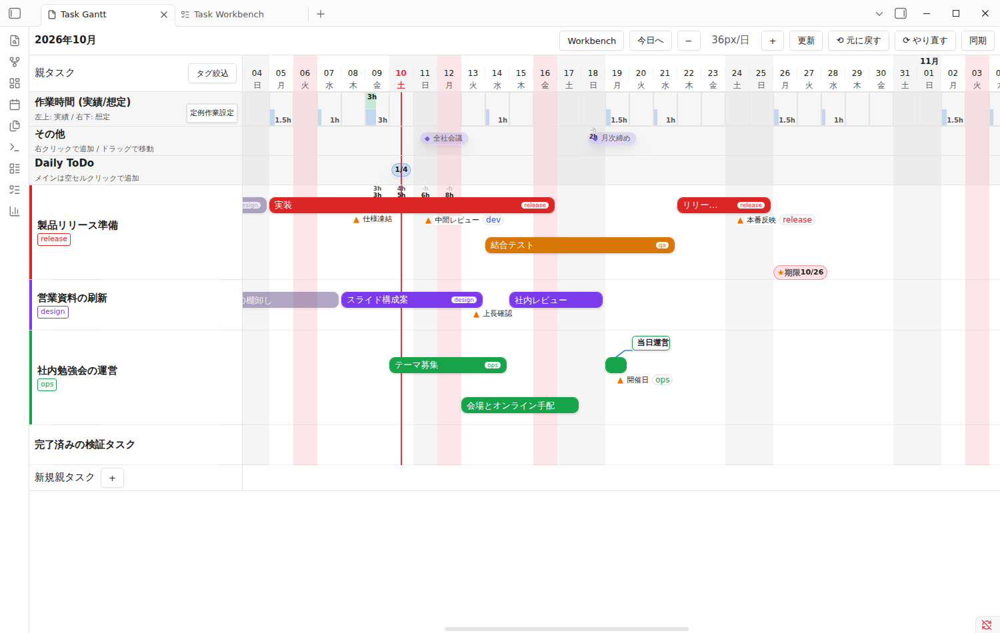
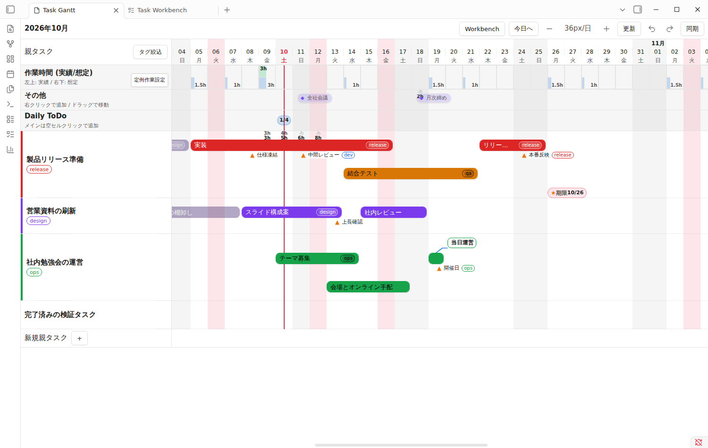
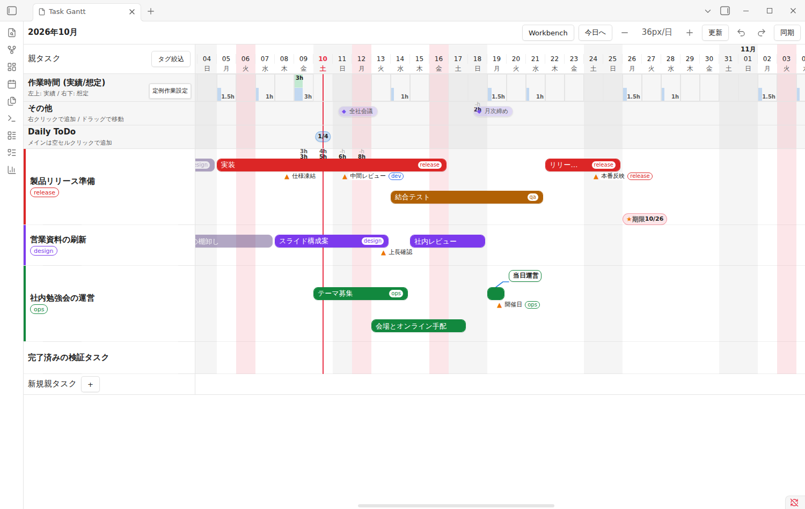
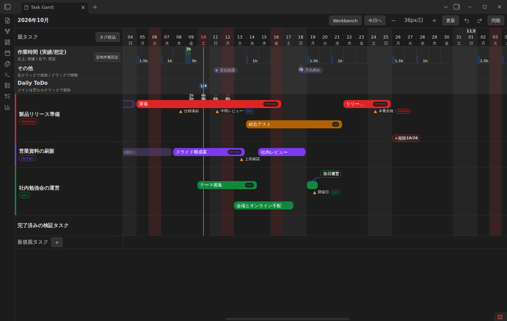
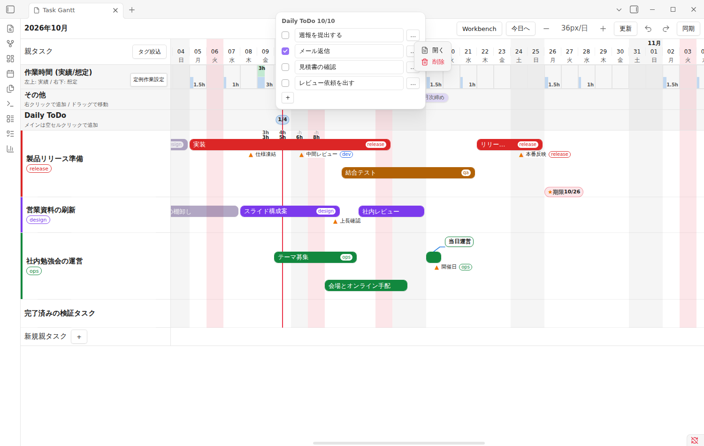
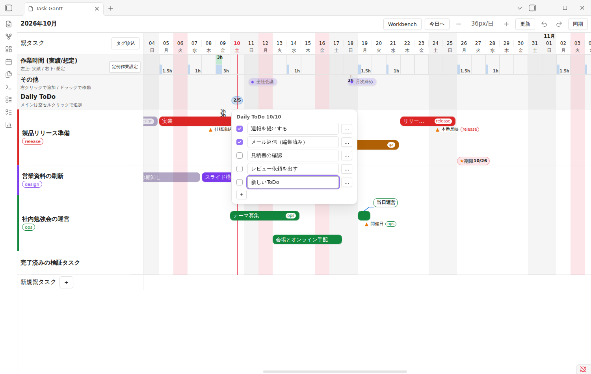
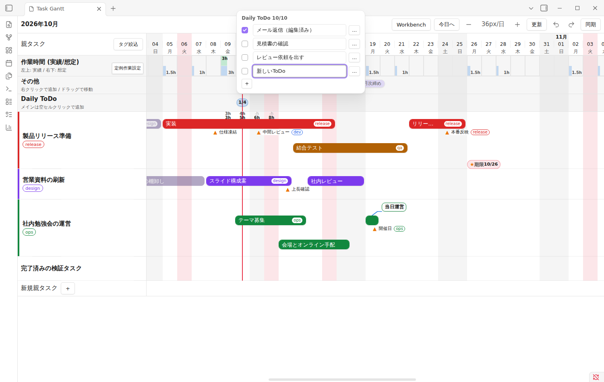
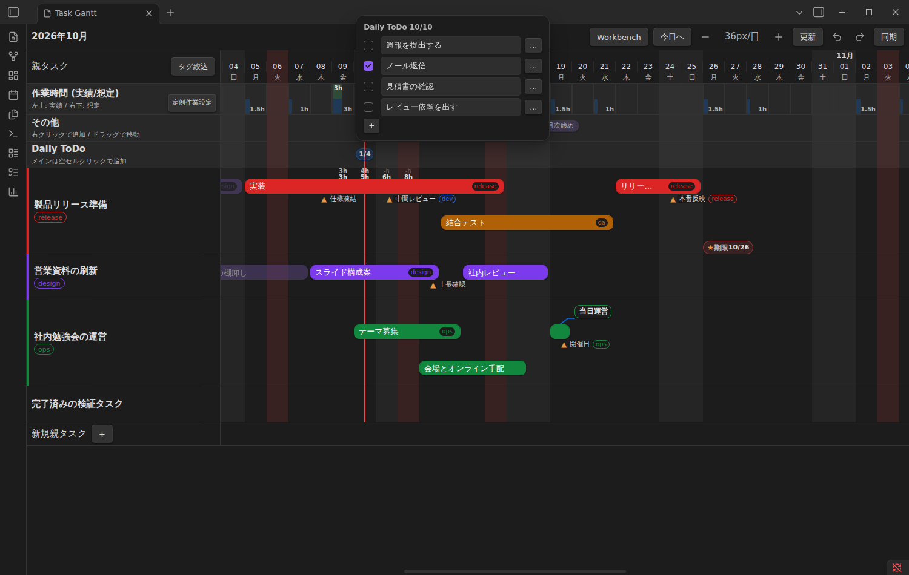
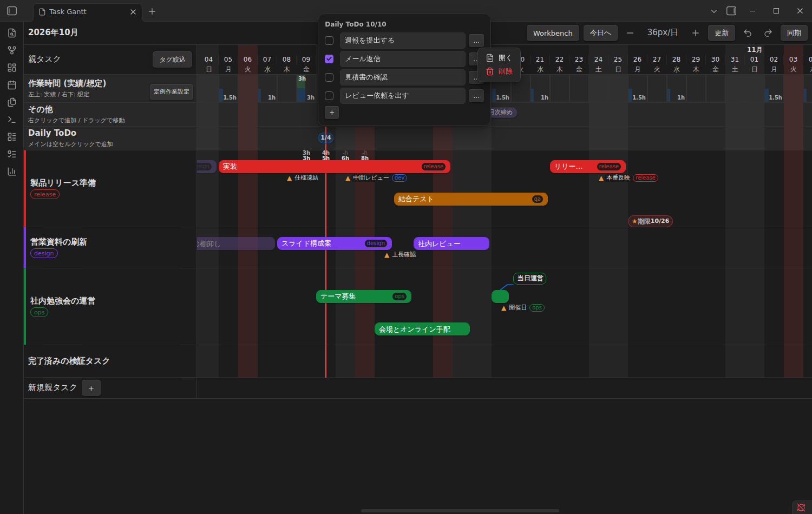

# 10/10 指摘への対応（バー文字色・タグ名・Daily ToDo）

## バー文字色とタグ名
バー文字は白に戻し、白が読みにくかった既定色（緑・橙・水色）だけ色相を保って少し暗くしました。保存済みの色は変えていません。バー内のタグ名は従来の白いピルに戻しました。

| 元（デザイン統一前） | PR #25 直後（黒文字） | 今回 |
|---|---|---|
|  |  |  |

ダーク: 

## Daily ToDo
モーダルをやめ、ポップオーバーで [チェック][入力欄][…]、最後に [＋]。「…」に「開く」「削除」（削除は確認なし、Ctrl+Z で戻せる）。Enter かフォーカスを外すと1行ずつ保存。

| 前（モーダル） | 今回 |
|---|---|
|  |  |

| 「…」メニュー | ＋で追加 | 削除後 |
|---|---|---|
|  |  |  |

ダーク:  
