# 保留中の仕様修正 12件（左＝今の動き、右＝修正後）

どれも「普通に使っていて、気づかないうちにデータが変わる／思った通りに動かない」ものです。
実際の Obsidian で、同じ操作を修正前と修正後の両方で行って撮りました（合成データ）。

| 区分 | PR |
|---|---|
| データが消える・壊れる | #15, #11, #13, #18 |
| 元に戻せない | #16 |
| 操作によって結果が違う | #19, #20, #21, #22 |
| Daily ToDo（**ポップオーバー化で大半が解決済み**） | #12, #17, #23 |

---

## データが消える・壊れる

### PR #15　期限を変えただけで、自分で書き足した内容が消える
**どんな時**：タスクのノートに、自分で `project: 顧客A` のようなプロパティや「## 参考資料」のような見出しを書き足している。
**今の動き**：ワークベンチで期限を変えるなどして保存すると、ノートがプラグインの決まった形で丸ごと書き直され、書き足した部分が**消える**。
**修正後**：プラグインが管理する部分だけ書き換え、書き足した部分は残す。
**失うもの**：書き方によっては保存できず通知が出ることがある。プロパティの並び順が変わることがある。

| 今：`project` と「参考資料」が消えた | 修正後：残っている |
|---|---|
| 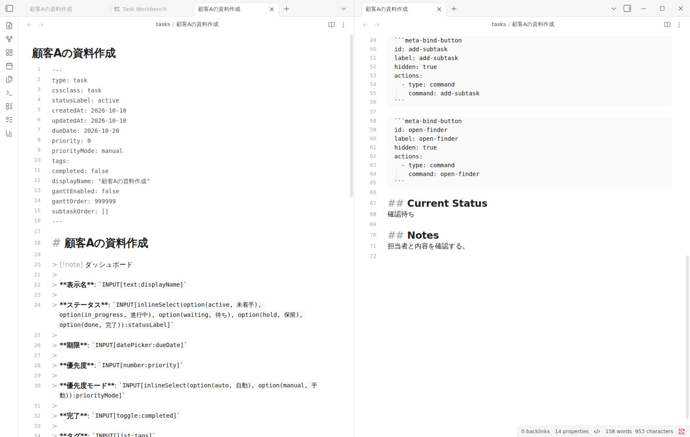 | 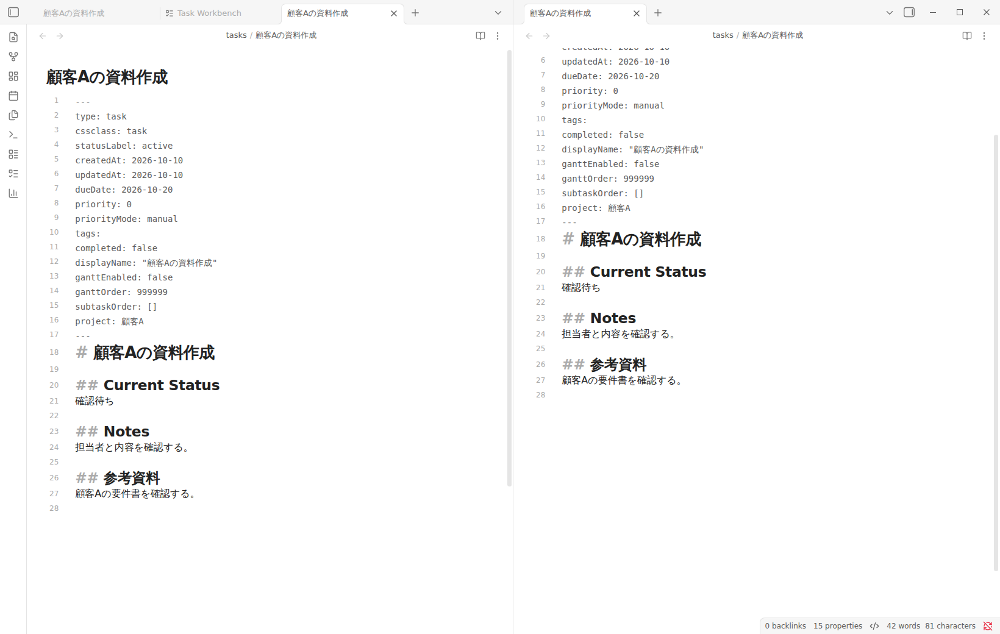 |

### PR #11　見出しを並べ替えると、別のサブタスクの期限が付く
**どんな時**：ノート本文でサブタスクの見出し（「設計」「実装」）の順番を入れ替えた。
**今の動き**：プラグインは見出しを「上から何番目か」で対応させているので、**設計の期限が実装に、実装の期限が設計に**表示される。
**修正後**：見出しの名前で照合し、合わなければ編集を止める。
**失うもの**：**そのタスクが一覧から消える**。お知らせも画面に出なかった。おすすめしない（直すならもっと親切な形にしたい）。

| 今：期限が入れ替わって表示 | 修正後：一覧から消える |
|---|---|
| 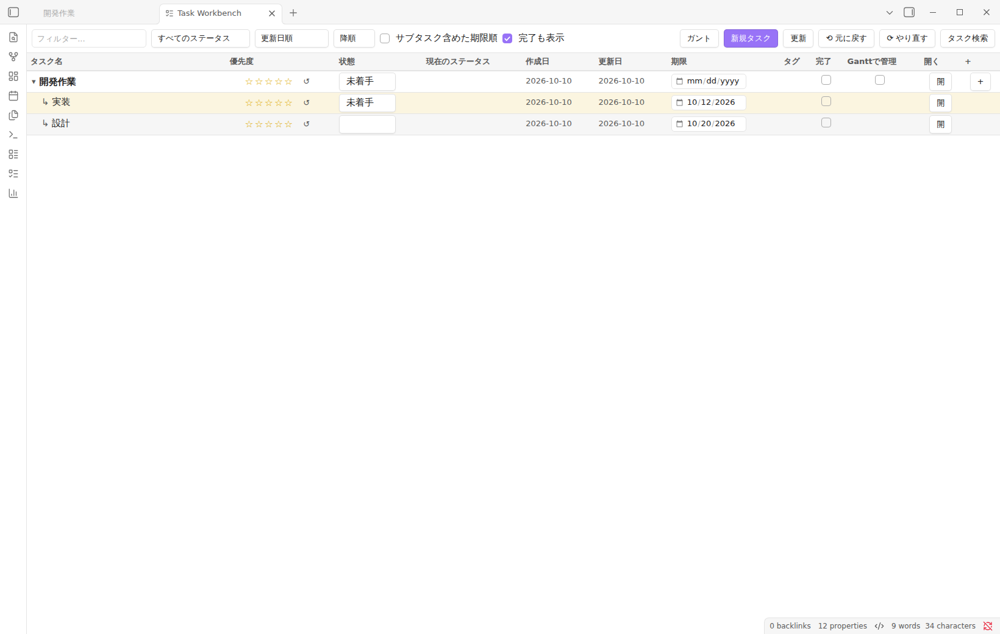 | 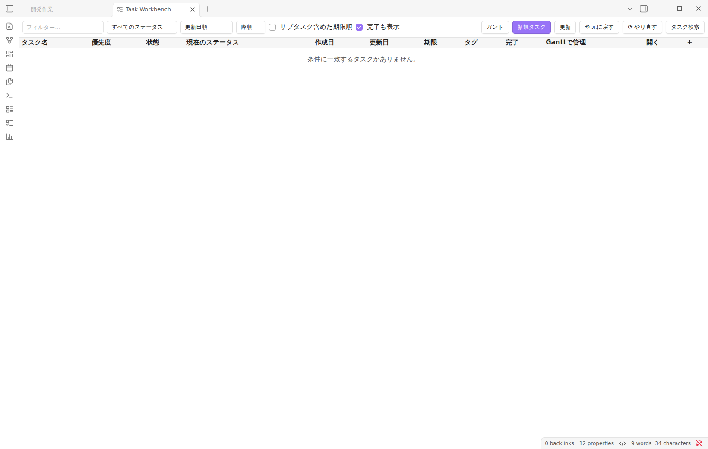 |

### PR #13　Gantt でサブタスクを追加すると、直前のノート編集が消える
**どんな時**：Gantt でサブタスク追加の画面を開いている間に、親ノートのメモや期限を書き換えた。
**今の動き**：追加した瞬間、画面を開いた時点の古い親ノートで上書きされ、**直前に書いたメモと期限が消える**。
**修正後**：追加する直前に最新のノートを読み直す。
**失うもの**：ほぼなし。

| 今：メモと期限が消えた | 修正後：残っている |
|---|---|
| 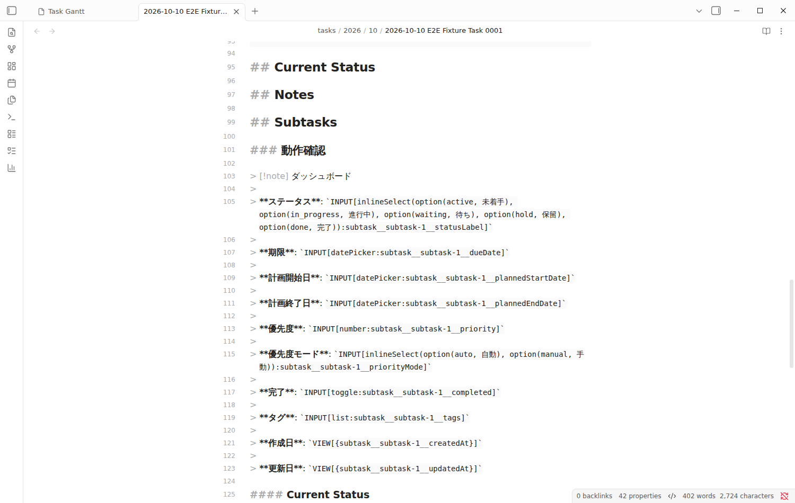 | 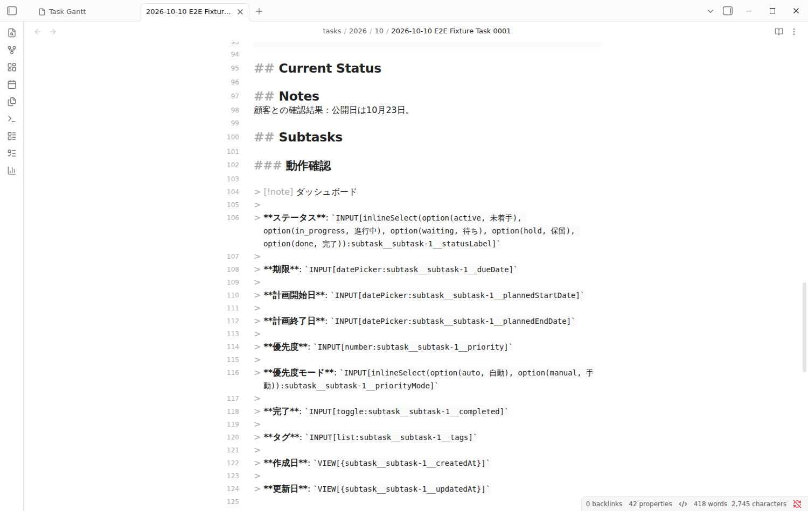 |

### PR #18　タグを YAML のリストで書くと消える
**どんな時**：Obsidian 標準のプロパティ欄でタグを編集した（Obsidian はタグを `- work` のようなリスト形式で書く）。
**今の動き**：プラグインは `tags: work, urgent` の1行形式しか読めないので、タグなしと見なし、次に保存した時に**タグが消える**。
**修正後**：リスト形式も読み、`["work","urgent"]` の形で保存する。
**失うもの**：タグを手で `work, urgent` と書いているなら不要。保存形式が変わる。

| 今：保存後に tags が空 | 修正後：残っている |
|---|---|
| 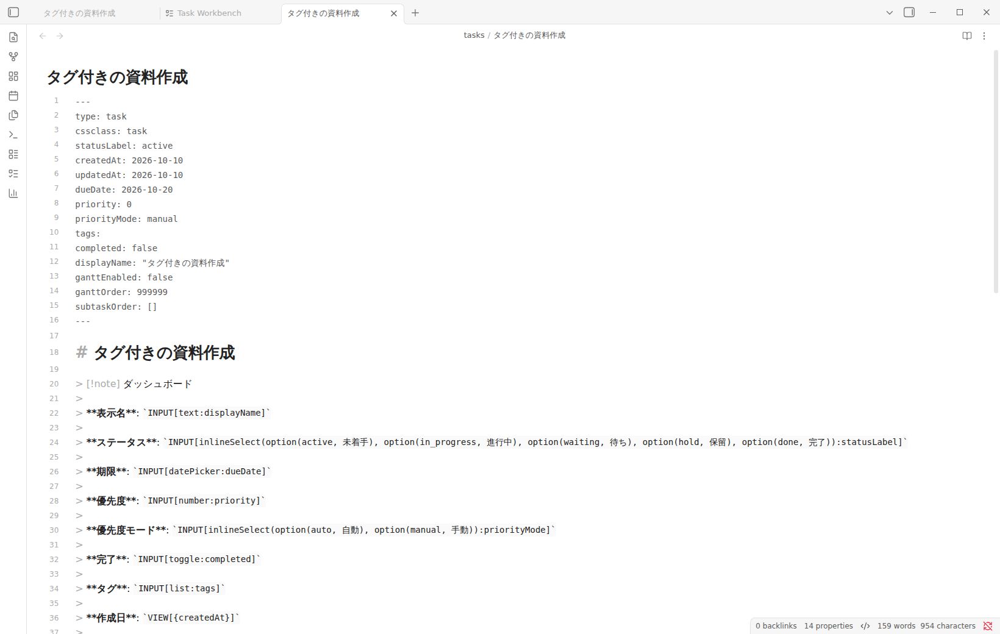 | 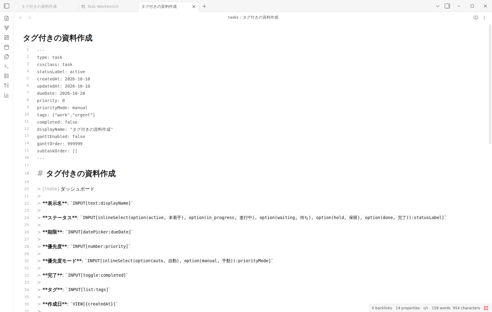 |

---

## 元に戻せない

### PR #16　追加・削除をすると、それより前の「元に戻す」が全部消える
**どんな時**：期限を変えた後、Gantt でサブタスクを追加した。
**今の動き**：追加・削除のたびに Undo 履歴が全消去され、**期限の変更も戻せなくなる**。
**修正後**：追加・削除も履歴に記録し、前の操作も順に戻せる。
**失うもの**：履歴の分メモリを少し使う。
※ Daily ToDo の保存はポップオーバー化（PR #26）で既に戻せるようになった。残っているのは Gantt の追加・削除。

| 今：2回戻しても期限とサブタスクが残る | 修正後：両方戻った |
|---|---|
| 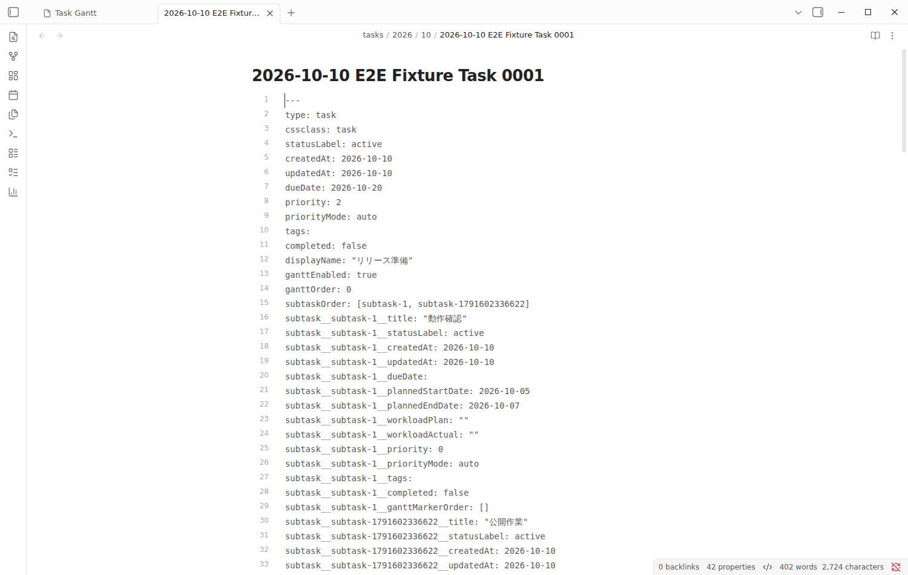 | 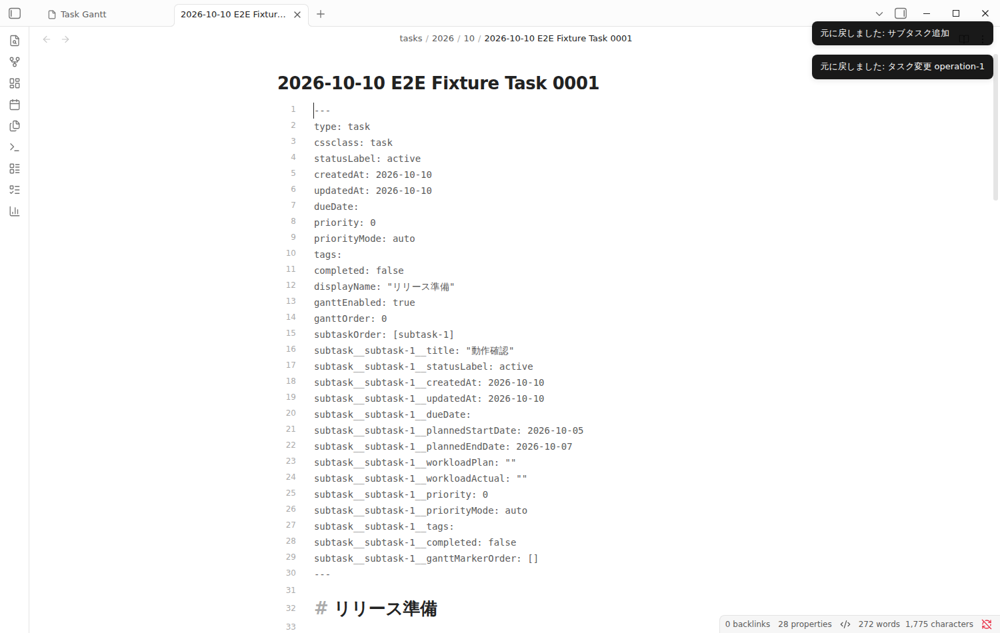 |

---

## 操作によって結果が違う

### PR #19　同じ「1日右へ」でも、まとめて動かすと土曜日に置かれる
**どんな時**：金曜（10/9）のタスクを1日右へ動かす。10/12 は祝日。
**今の動き**：1つだけ動かすと休日を飛ばすのに、「これ以降を纏めて移動」だと**土曜（10/10）に置かれる**。
**修正後**：まとめて動かしても休日を飛ばす（この例では 10/13 火）。
**失うもの**：まとめて動かした時、タスク同士の「暦日の間隔」は保たれなくなる。

| 今：土曜に置かれた | 修正後：休日を飛ばした |
|---|---|
| 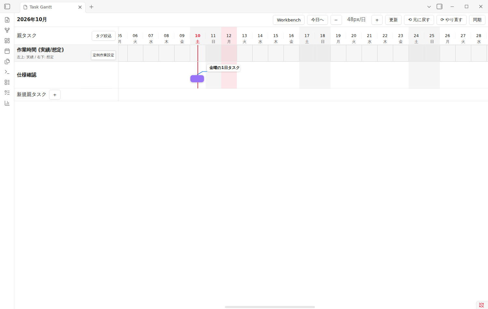 | 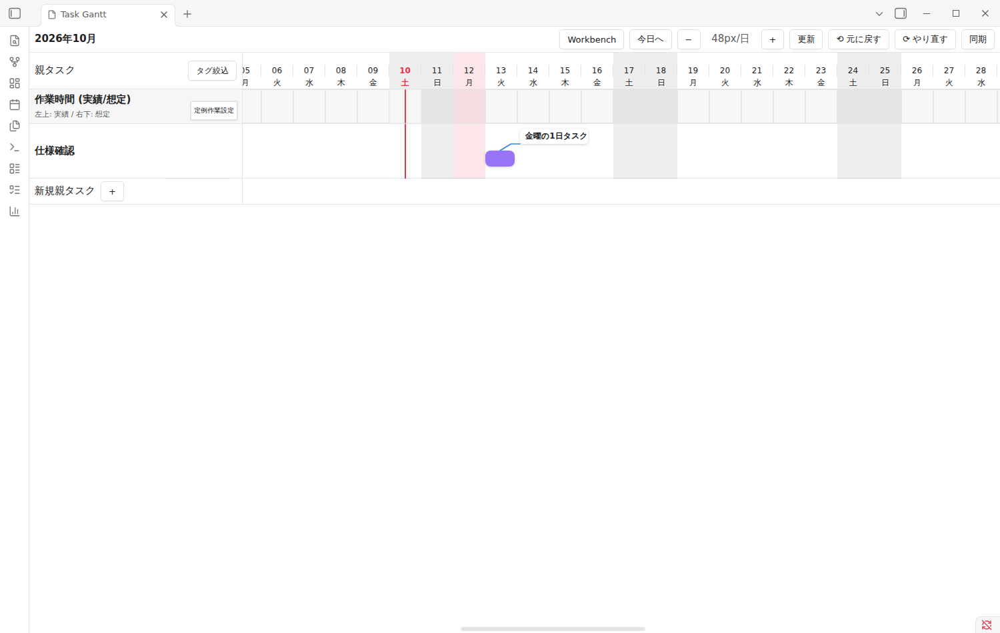 |

### PR #20　まとめて動かすと、実際に作業した時間まで未来に移る
**どんな時**：10/5 に「計画2時間・実績1時間」があるタスクを、まとめて1日右へ動かす。
**今の動き**：**実績（もう働いた時間）まで 10/6 に移る**。1つだけ動かすと逆に計画が元の日に残る。
**修正後**：どちらの動かし方でも、計画は移し、実績は元の日に残す。
**失うもの**：移動で実績の日付を直すことはできなくなる（実績は別に編集）。

| 今：実績も 10/6 へ | 修正後：実績は 10/5 に残る |
|---|---|
| 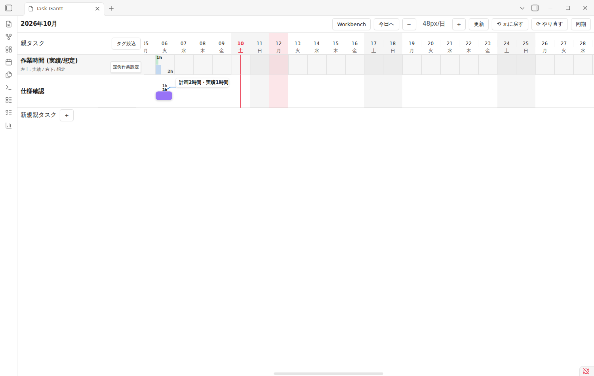 | 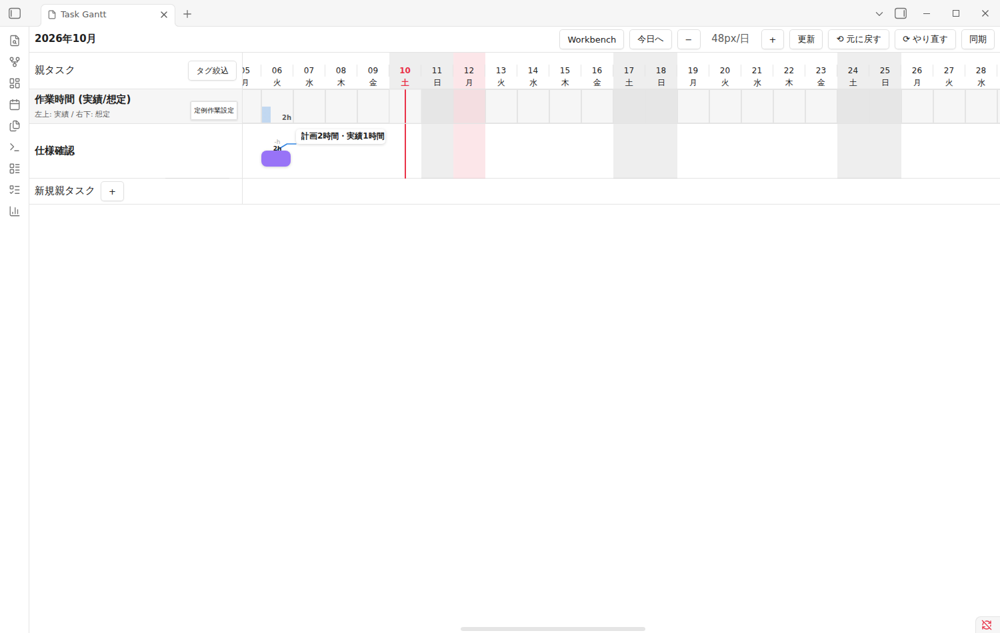 |

### PR #21　「完了」なのに「完了を隠す」で消えない
**どんな時**：ノートのステータスが「完了」なのに、完了フラグが false のまま（手で書き換えた時など）。
**今の動き**：一覧には「完了」と出るのに、「完了も表示」をオフにしても**消えない**。逆に未着手のものが消えることもある。
**修正後**：ステータスを正として扱う。
**失うもの**：わざと食い違わせていたノートは表示が変わる。

| 今：完了が残り、未着手が消える | 修正後：完了だけ消える |
|---|---|
| 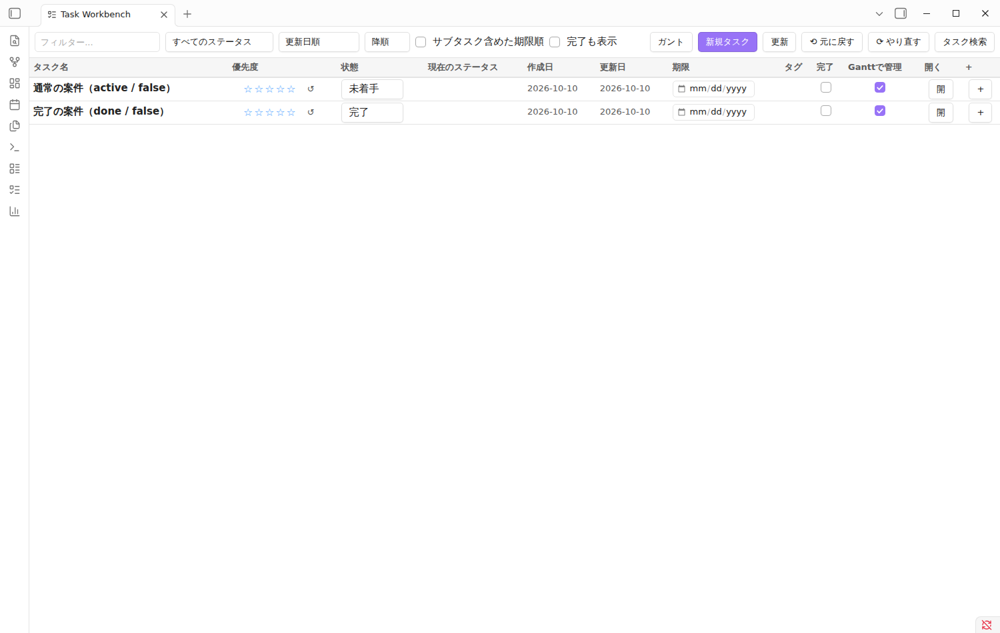 | 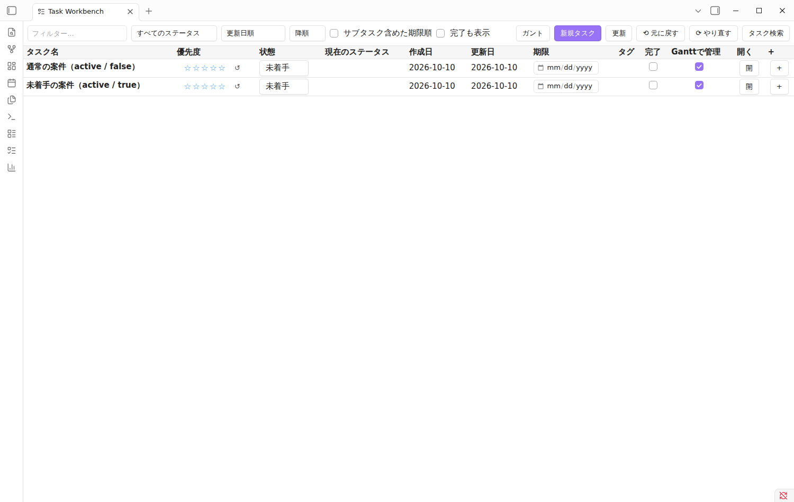 |

### PR #22　ドラッグで1日のタスクに縮められない
**どんな時**：月〜火のタスクの右端を左へドラッグして、月曜だけにしたい。
**今の動き**：**火曜まで戻される**（作る時は1日タスクを作れるのに）。
**修正後**：同じ日まで縮められる。
**失うもの**：特になし。

| 今：2日のまま | 修正後：1日に縮んだ |
|---|---|
| 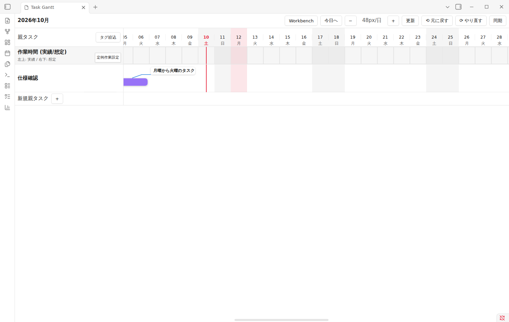 | 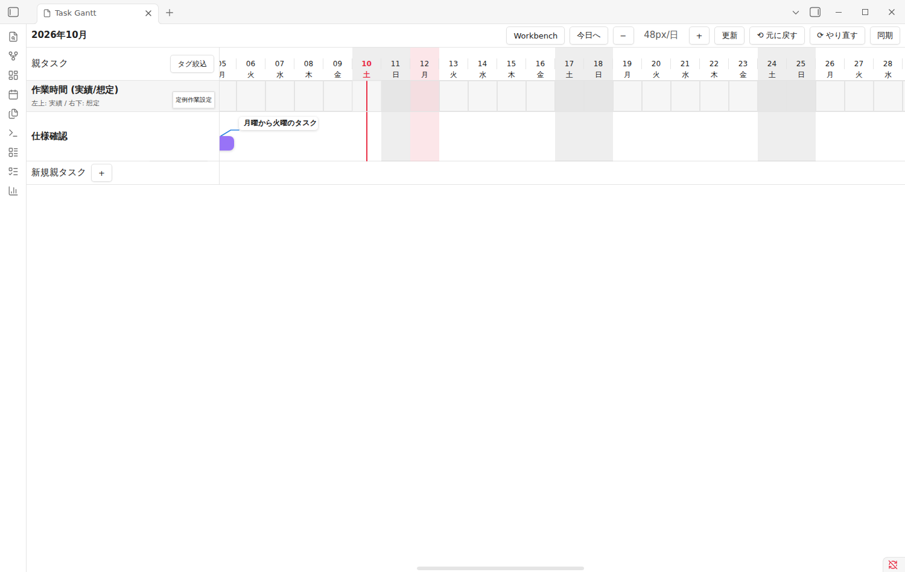 |

---

## Daily ToDo（ポップオーバー化で大半が解決済み）

撮影は古いモーダルで行ったものです。PR #26 のポップオーバー化で状況が変わりました。

- **PR #12（編集中にノートが変わると別の行を上書き）** → ポップオーバーは書き込み前に元の行か照合するので**解決済み**。この PR は不要。
- **PR #23（文字を全部消して保存しても元に戻る）** → ポップオーバーでは空欄は元に戻し、消したい時は「…」→「削除」。**解決済み**。この PR は不要。
- **PR #17（「新規作成可」にした独自の取得元に追加できない）** → これは**未解決**。設定で追加先を選べるようにする修正。ただし追加される位置がノート末尾になる点は直す必要あり。

| #12 今：見出しが ToDo に置き換わった | #12 修正後：止まって元のまま |
|---|---|
| 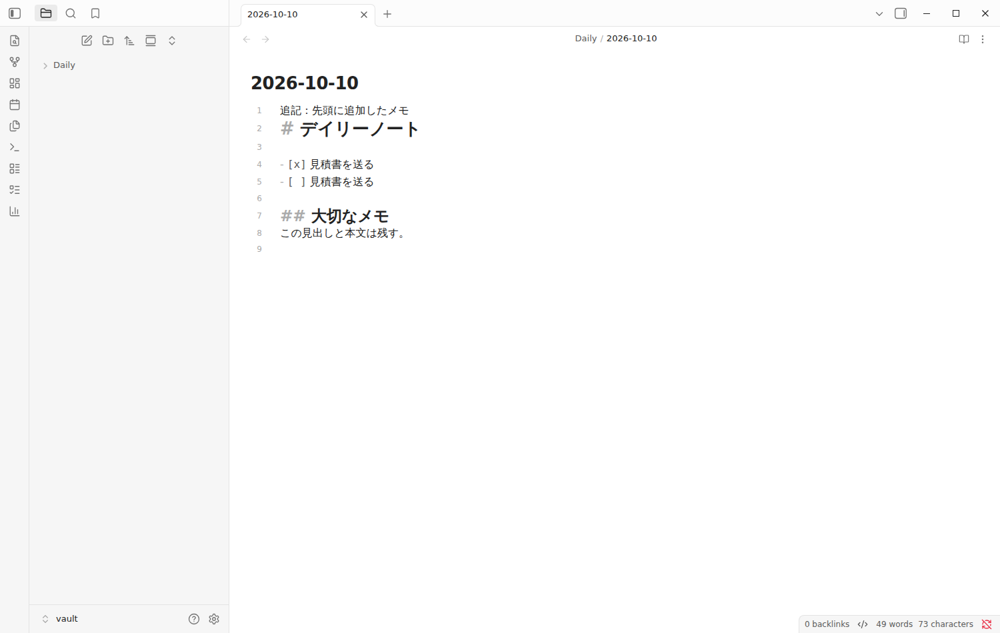 | 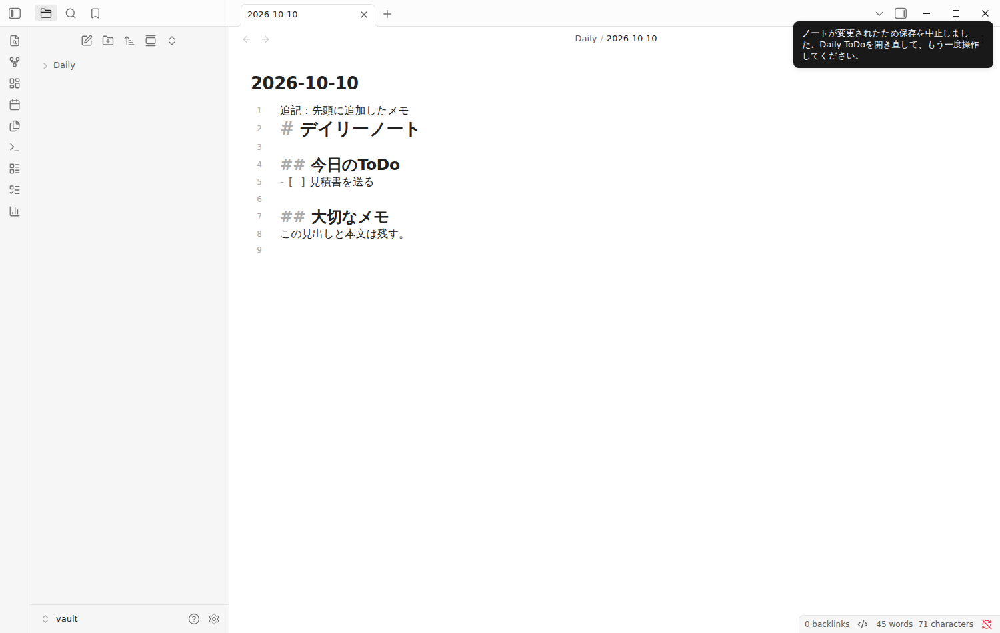 |

| #17 今：追加できない | #17 修正後：追加できた（ただし末尾） |
|---|---|
| 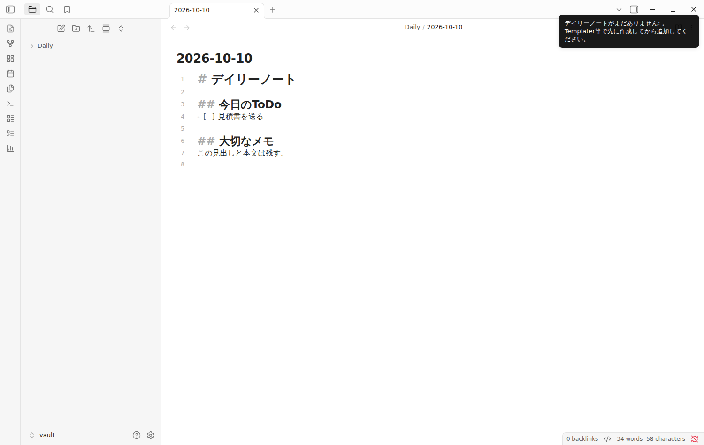 | 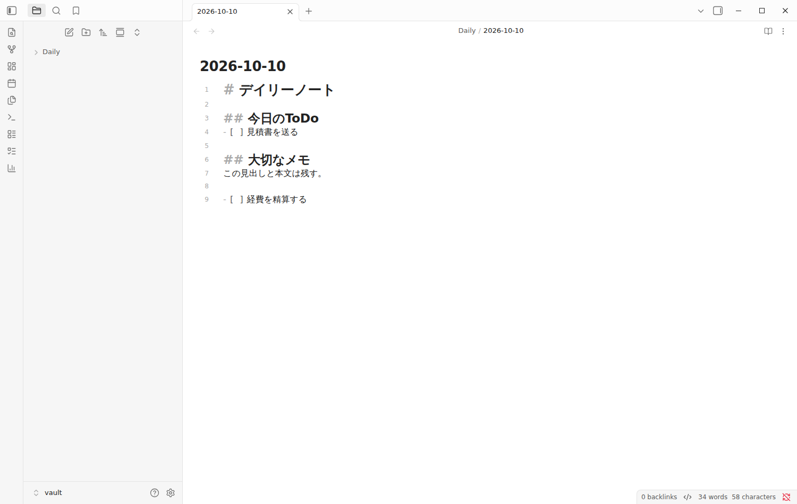 |
